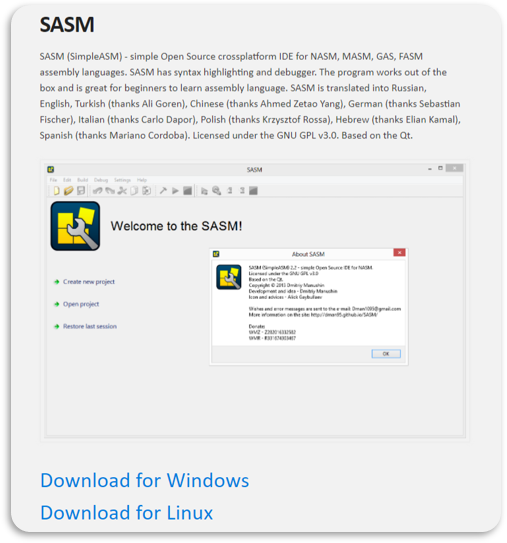
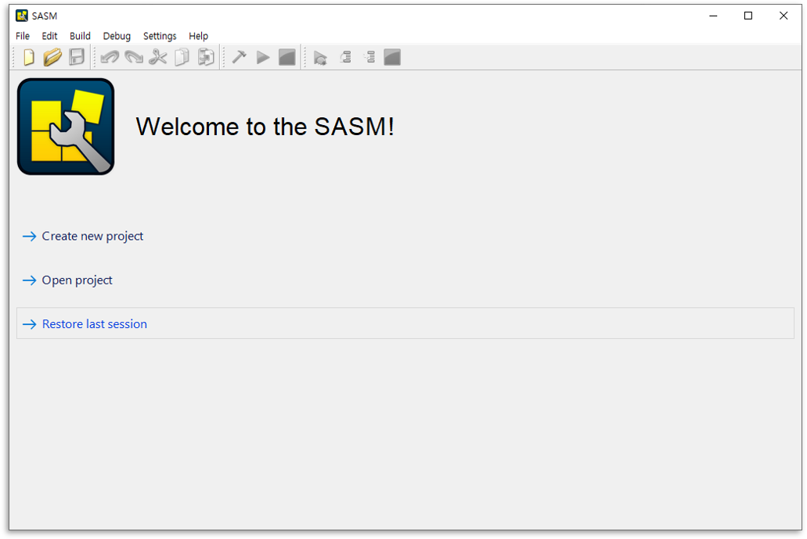
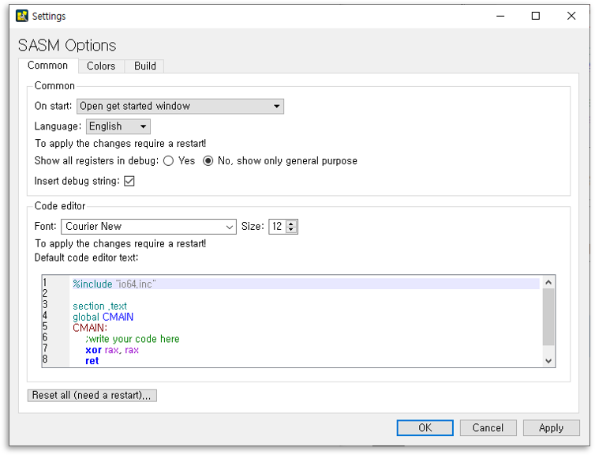
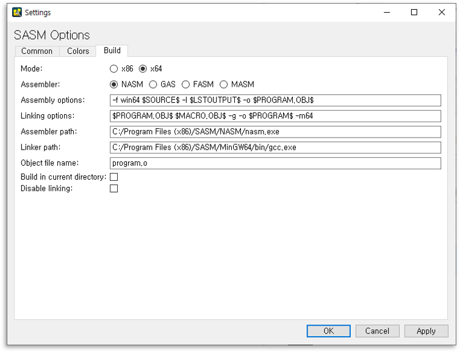
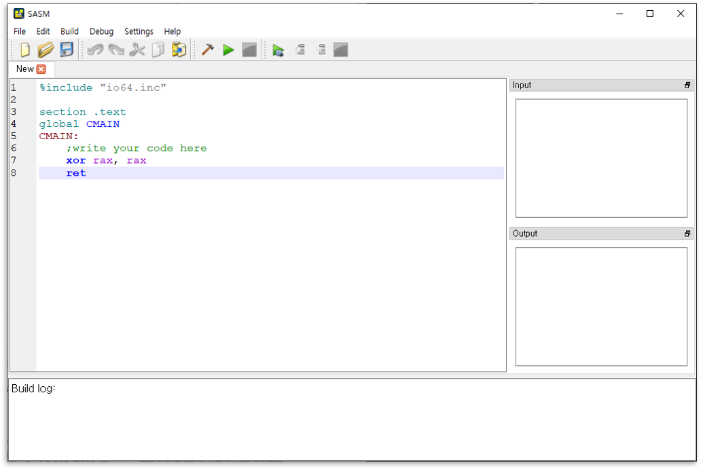

# 1. 저급 프로그래밍 언어(Low-Level Programming Language)
- 컴퓨터가 이해하기 쉽게 작성된 언어.
- 장점
    - 실행속도가 빠르다.
- 단점
    - 유지보수가 어렵다

 

## 1. 기계어란
- `변환 과정 없이` CPU가 직접 처리할 수 있는 저급 프로그래밍 언어이다.
- `0`과 `1`로 이루어져 있다

## 2. 어셈블리언어란
- `어셈블리 언어`는 기계어와 `일대일(1:1) 대응`되는 저급 프로그래밍 언어이다.
- 기계어를 사람들이 알아보기 쉬운 `니모닉 기호(Mnemonic Symbol)`로 표현할 수 있게 했으며, 쉽게 컴퓨터를 제어 할 수 있다.
- `CPU 제조사`마다 언어가 틀리다

 

# 2. 어셈블리 언어 실습 환경 설정
## 1. SASM 설치
 - 어셈블리 언어 실습에서 사용할 통합 개발 환경(Integrated Development Environment, IDE)은 `SASM`이다.
 - 다운로드 경로 : <https://dman95.github.io/SASM/english.html>
    
 
 > 운영체제(Windows or Linux)에 맞는 설치파일을 다운로드 받은 후, 컴퓨터에 설치한다.

 
 > 설치 완료 후 프로그램 모습이다.

## 2. 설정
- [Settings > Settings]에서 프로젝트에 대한 기본 설정을 합니다.
    1. **Common**
        
        > • 자신의 컴퓨터의 환경에 맞에 `Code editor>Default Code editor text` 부분을 수정한다.  
        > **io.inc** : x86(32bit), **io64.inc** : x64(64bit)  

    2. **Build**
        
        > 1. 자신의 컴퓨터 환경에 맞는 `Mode`를 선택한다.  
        > **x86** : 32bit, **x64** : 64bit  
        > 2. `Assembler`는 `NASM`을 선택한다.  
        > **Assembler** : 번역기, 어셈블리 언어를 기계어로 변환해 주는 역할

 

## 3. 새 프로젝트 생성
- `Create new project`를 통해 새 프로젝트를 생성한다.
    
 

# 📑. 참고
* [저급 프로그래밍 언어 - 위키백과, 우리 모두의 백과사전](https://ko.wikipedia.org/wiki/%EC%A0%80%EA%B8%89_%ED%94%84%EB%A1%9C%EA%B7%B8%EB%9E%98%EB%B0%8D_%EC%96%B8%EC%96%B4)
* [어셈블리어 - 위키백과, 우리 모두의 백과사전](https://ko.wikipedia.org/wiki/%EC%96%B4%EC%85%88%EB%B8%94%EB%A6%AC%EC%96%B4)
* [Rookiss. [C++과 언리얼로 만드는 MMORPG 게임 개발 시리즈]Part1: C++ 프로그래밍 입문. Inflearn.](https://www.inflearn.com/course/%EC%96%B8%EB%A6%AC%EC%96%BC-3d-mmorpg-1/dashboard)