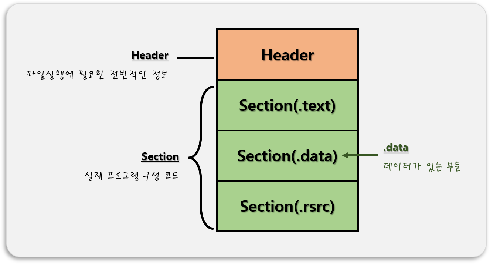

# 0. PE(Portable Excutable) 포맷
- 윈도우에서 사용되는 `실행 가능한 파일` 형식 
- **ex)** .exe, .dll, .obj, .sys …  

- 어셈블리 언어 실습 기본 코드
    ```avrasm
    %include "io64.inc"

    section .text
    global CMAIN
    CMAIN:
        ;write your code here
        xor rax, rax
        ret
        
    section .bss

    section .data
    ```

<br>

# 1. 데이터 기초
## 1. 컴퓨터의 데이터 단위
- 컴퓨터는 0과 1로 이루어진 데이터를 사용한다.
 ### 1. 비트 (Bit, Binary Digit)
 - `0` == OFF == `False`(거짓)
 - `1` == ON == `True`(참)

 ### 2. 바이트 (Byte)
 - `8bit` == 1byte (부호를 가지는 정수 일 때, -128~127 사이의 표현이 가능하다.)

## 2. 진수 (Notation)
 ### 1. 10진수
 - `0, 1, 2, 3, 4, 5, 6, 7, 8, 9`의 숫자로만 수를 표현한다.
 - **ex)** 1, 2, 3, 4, 5, 6, 7, 8, 9, 10, 11, 12, … , 20, 21, … , 99, 100, 101, …

 ### 2. 2진수
 - `0, 1`의 숫자로만 수를 표현한다.
 
 ### 3. 8진수

 ### 4. 16진수

<br>

# 2. 레지스터 기초
## 1. 

# 3. 어셈블리 언어 데이터 실습


<br>

# 📑. 참고
* [Rookiss. [C++과 언리얼로 만드는 MMORPG 게임 개발 시리즈]Part1: C++ 프로그래밍 입문. Inflearn.](https://www.inflearn.com/course/%EC%96%B8%EB%A6%AC%EC%96%BC-3d-mmorpg-1/dashboard)