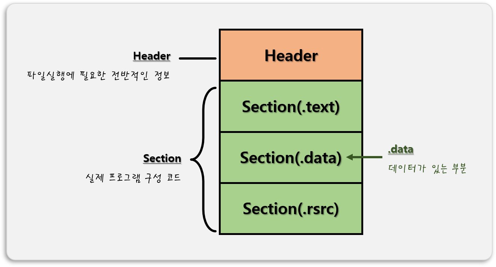
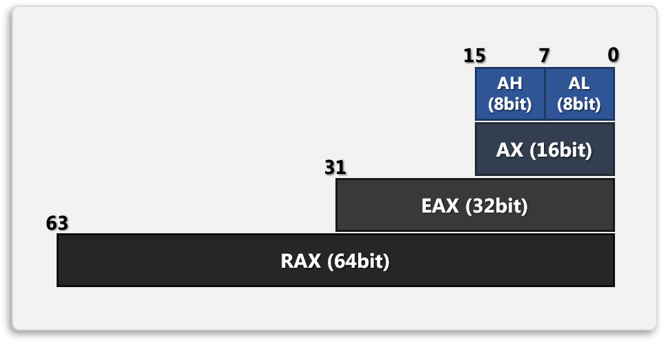

# 0. PE(Portable Excutable) 포맷
- 윈도우에서 사용되는 `실행 가능한 파일` 형식 
- **ex)** .exe, .dll, .obj, .sys …  

- 어셈블리 언어 실습 기본 코드
    ```avrasm
    %include "io64.inc"

    section .text
    global CMAIN
    CMAIN:
        ;write your code here
        xor rax, rax
        ret
        
    section .bss

    section .data
    ```

<br>

# 1. 데이터 기초
## 1. 컴퓨터의 데이터 단위
 - 컴퓨터는 0과 1로 이루어진 데이터를 사용한다.
### 1. 비트 (Bit, Binary Digit)
 - `0` == OFF == `False`(거짓)
 - `1` == ON == `True`(참)

### 2. 바이트 (Byte)
 - `8bit` == 1byte (부호를 가지는 정수 일 때, -128~127 사이의 표현이 가능하다.)

## 2. 진수 (Notation)
### 1. 10진수
 - `0, 1, 2, 3, 4, 5, 6, 7, 8, 9`의 숫자로 수를 표현한다.
 - **ex)** 1, 2, 3, 4, 5, 6, 7, 8, 9, 10, 11, 12, … , 20, 21, … , 99, 100, 101, …

### 2. 2진수
 - `0, 1`의 숫자로 수를 표현한다.
 - **ex)** 0, 1, 10, 11, 100, 101, 110, 111, 1000 …
 - 숫자가 커질수록 `표기해야 할 숫자`가 많아진다.
 
### 3. 8진수
 - `0, 1, 2, 3, 4, 5, 6, 7`의 숫자로 수를 표현한다.
 - **ex)** 0, 1, 2, 3, 4, 5, 6, 7, 10, 11, 12, 13, … , 20, 21, … , 77, 100, 101, …  

### 4. 16진수
 - `0, 1, 2, 3, 4, 5, 6, 7, 8, 9, A(10), B(11), C(12), D(13), E(14), F(15)`의 숫자와 문자로 수를 표현한다.
 - **ex)** 0, 1, 2, 3, 4, 5, … , E, F, 10, 11, 12, … , 1F, 20, 21, … , FF, 100, 101, …
 - 2진수와 서로 `변환`이 쉽다.

<br>

# 2. 레지스터 기초
## 1. 레지스터 데이터 단위
 1. `1bit`
 2. 8bit = `1byte`
 3. 16bit = 2byte = `1word`
 4. 32bit = 4byte = 2word = `1dword` (double-word)
 5. 64bit = 8btye = 4word = 2dword = `1qword` (quad-word)

## 2. 레지스터
 - `레지스터(Register)`
    1. CPU 안의 작은 기억장치 이다. 
    2. 연산의 중간 결과물을 저장하는 용도이다.
    3. 접근속도가 빠르다
    4. 용량이 적다.
    
    


<br>

# 📑. 참고
* [AMD's Voyage into the 64-bit Arena: x86-64 Revealed > How x86-64 Works](https://www.anandtech.com/show/598/5)
* [Rookiss. [C++과 언리얼로 만드는 MMORPG 게임 개발 시리즈]Part1: C++ 프로그래밍 입문. Inflearn.](https://www.inflearn.com/course/%EC%96%B8%EB%A6%AC%EC%96%BC-3d-mmorpg-1/dashboard)