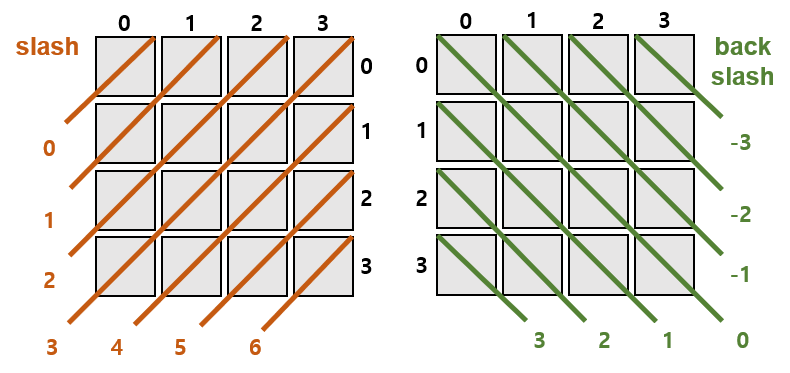

# 🗒️ [9663번) N-Queen](https://www.acmicpc.net/problem/9663)

```cpp
#include <iostream>
using namespace std;

int N, res(0);
bool col[15], slash[30], backslash[30];
void Queen(int r)
{
	if (r == N)
	{
		res++;
		return;
	}

	for (int c = 0; c < N; c++)
	{
		if (col[c] || slash[r + c] || backslash[r + N - c - 1])
			continue;

		col[c] = true;
		slash[r + c] = true;
		backslash[r + N - c - 1] = true;
		Queen(r + 1);

		col[c] = false;
		slash[r + c] = false;
		backslash[r + N - c - 1] = false;
	}
}

int main()
{
	ios::sync_with_stdio(false);
	cin.tie(nullptr);

	cin >> N;
	Queen(0);
	cout << res;

	return 0;
}
```
- 풀이 참고

