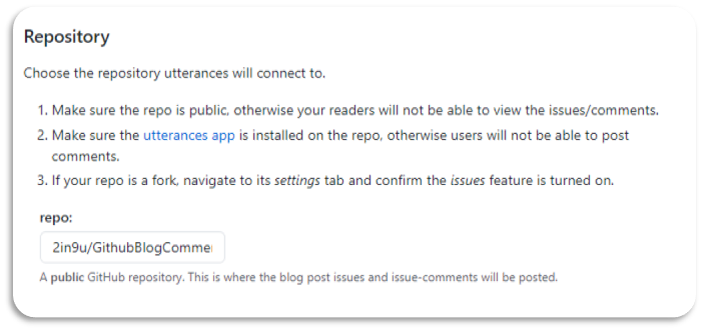
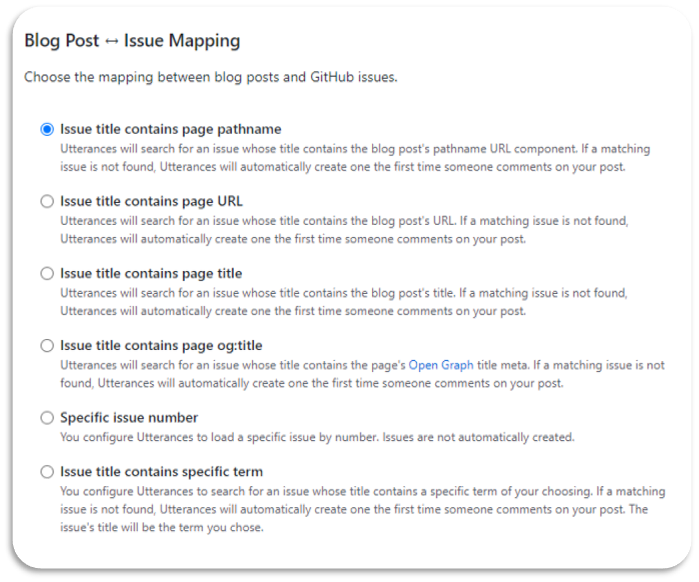
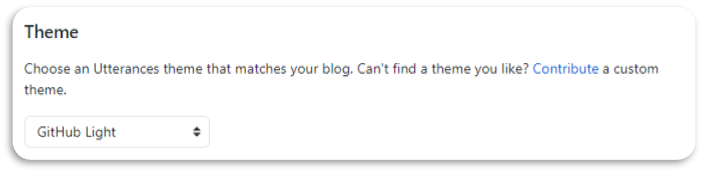
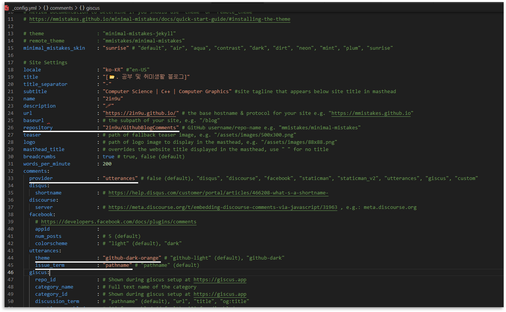
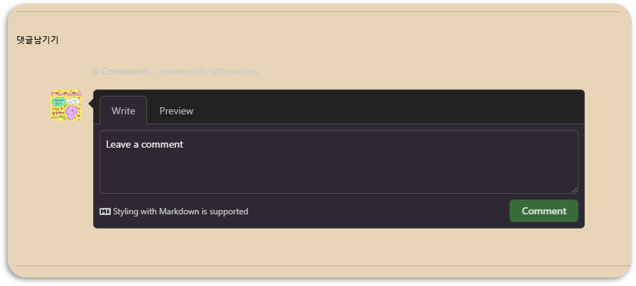

# 1. 🔮Utterances 선택 이유
github blog를 셋팅하면서 댓글 기능 적용에 대해서 알아보던 중 `disqus`가 가장 많이 나오길래 disqus로 적용할려고 하였다. 하지만, 무료버전엔 `광고`가 붙고 `무겁다`고 한다. 그래서 다른 것을 찾아보던 중 `utterances`를 발견하였다. 

## 🔮Utterances 장점
 > 1. utterances는 `github app`이기에 github 계정만 있으면 된다.  
 > 2. 설치, 셋팅, 관리가 `쉽다`.  
 > 3. 댓글이 등록되면 새로운 issue가 등록되어 `메일으로 알람`을 받을 수 있다.  
 > 4. `Markdown 문법을 이용`하여 댓글 작성이 `가능`하다.  

 

# 2. 🔮Utterances 설치 및 셋팅
## Ⅰ. Utterances 설치
1. [GitHub App utterances Install Link](https://github.com/apps/utterances
)에서 utterances를 `설치` 한다.

2. Install 버튼을 누른 후, 댓글을 관리할 `저장소`를 선택해준다. 
   > ⁕ 댓글을 저장 할 repository는 public으로 새로 만들어 주었다. (2in9u/GithubBlogComments)

    

## Ⅱ. Utterances 설정
1. Repository 설정
   * `repo:`에 `username/repo-name`을 입력한다.
   

2. Blog Post ↔ Issue Mapping 설정
   * 블로그 포스트 중 어떤 것을 `이슈 제목`으로 `설정`할 것인지 선택한다.
   * 잘 변경이 되지 않는 것으로 설정해 주는 것이 좋다.
    

3. Theme 설정
    * utterances의 `테마`를 선택한다.
    > ⁕ 테마는 선택한 옵션에 따라서 현재 페이지 색상이 변하기 때문에 원하는 테마로 선택한다.

    

## Ⅲ. minimal-mistakes에 Utterances 설정
1. `minimal-mistakes 테마`는 `_config.yml`에 몇 가지 설정만 해주면 바로 적용된다. 그 외는 `Enable Utterances`를 복사해서 코드에 추가하면된다.
    > minimal-mistakes 테마 utterances 설정 방법  (`_config.yml`)
    > - `repository` : "댓글을 관리할 저장소(username/repo-name)"  
    > - comments-`provider` : "utterances"
    > - comments-utterances-`theme` : "선택한 테마"
    > - comments-utterances-`issue_term` :  "선택한 이슈 맵핑"

    
    

## Ⅳ. 결과
1. 위의 과정을 완료 후 깃허브에 `push` 한 후 블로그를 확인한다.
2. 다음과 같이 적용된 것을 확인 할 수 있다.
   
> ⁕ 적용 된 결과는 로컬 서버로 접속했을 때 나타나지 않는다.

 

# 📑. 참고

* [utterances를 블로그 댓글로 적용하기 \| 아웃풋 트레이닝](https://baek.dev/post/4/)  
* [[Github] 블로그에 댓글 기능 추가하기 (ft.Utterances)](https://outstanding1301.github.io/dev/2021/01/07/utterances/)  
* [[Github 블로그] utterances 으로 댓글 기능 만들기 (+ disqus 비추후기)](https://ansohxxn.github.io/blog/utterances/#4-github-%EB%A9%94%EC%9D%BC-%EC%95%8C%EB%A6%BC-%EC%84%A4%EC%A0%95%ED%95%98%EA%B8%B0-%EB%A9%94%EC%9D%BC%EB%A1%9C-%EB%8C%93%EA%B8%80-%EC%95%8C%EB%A6%BC-%EB%B0%9B%EA%B8%B0)  