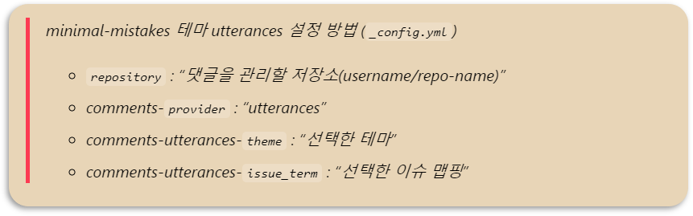
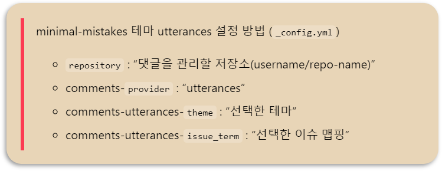

# 1. minimal-mistakes 인용문 스타일
minimal-mistakes의 기본 인용문의 `font-style`은 `Italic` 이다.


<br>

# 2. 스타일 변경하기
## 1. Blockquotes 기본설정
  코드는 `_base.scss`에 위치해 있다.
  > minimal-mistakes의 인용문 기본 설정이다. `font-style: italic`으로 인해 글씨가 기울어져서 출력된다.

  ```scss
  /* blockquotes */

  blockquote {
    margin: 2em 1em 2em 0;
    padding-left: 1em;
    padding-right: 1em;
    font-style: italic;
    border-left: 025em solid $primary-color;

    cite {
      font-style: italic;
      
      &:before {
        content: "\2014";
        padding-right: 5px;
      }
    }
  }
  ```

## 2. 사용자에 맞게 설정 바꾸기
  > font-style: italic을 해제하고, 인용문에 `패딩`을 추가했다.  
  > 왼쪽 인용문 표시의 `두께`도 수정하였다.

  ```scss
  /* blockquotes */

  blockquote {
    margin: 2em 1em 2em 0;
    padding-left: 1em;
    padding-right: 1em;
    padding-top: 0.3em;
    padding-bottom: 0.1em;

    border-left: 0.3em solid $primary-color;

    cite {

      &:before {
        content: "\2014";
        padding-right: 5px;
      }
    }
  }
  ```

<br>

# 3. 결과


<br>

# 📑. 참고
* [[Github Blog] 인용문(blockquote) customize하기 / 예쁘게 꾸미기](https://happy-jihye.github.io/blog/blog-2/)