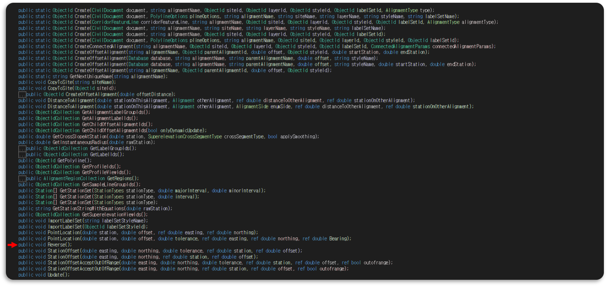
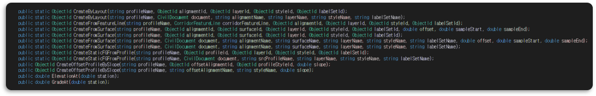

# 선형 역전에 따른 종단 역전시키기
- Offset 선형을 작성할 때, Offset 선형의 진향방향을 `역전(Reverse)` 시킬 때가 있다. 그때, 종단도 함께 역전시켜줘야하는데 종단엔 `Reverse()` 함수가 없다.
  > **Alignment Class**
  > 

  > **Profile Class**
  > 

  ```cs
  // Offset선형 생성
  Alignment offsetAlign = Alignment.CreateOffsetAlignment(…); 
  // Offset 종단 생성
  Profile offsetProf = prof.CreateOffsetAlignment(…); 

  offsetAlign.Reverse();
  // 예상 결과: 선형이 반전됨에 따라 종단도 자동으로 역전 됨.
  // 결과 : 종단은 역전되지 않음.
  ```

<br>

## 💡. 생각한 방법
 1. `PVI`를 Reverse 시킨다.
    ```cs
    Alignment offsetAlign = Alignment.CreateOffsetAlignment(…); 
    Profile offsetProf = prof.CreateOffsetAlignment(…);
    
    ProfilePVICollection offsetProf_pvis = offsetProf.PVIs;
    offsetProf_pvis.Reverse();
    // 결과 : 종단이 역전되지 않음.
     ```

 2. `ProfileEntity`를 Reverse 시킨다.
    ```cs
    Alignment offsetAlign = Alignment.CreateOffsetAlignment(…);
    Profile offsetProf = prof.CreateOffsetAlignment(…);

    ProfileEntityCollection offsetProf_entities = offsetProf.Entities;
    offsetProf_entities.Reverse();
    // 결과 : 종단이 역전되지 않음.
    ```

<br>

## 📌. 해결방법
- `종단 생성 전`에 선형을 먼저 `역전`시키면 자동으로 종단도 역전되서 만들어진다.
  ```cs
  Alignment offsetAlign = Alignment.CreateOffsetAlignment(…); 
  offsetAlign.Reverse();

  Profile offsetProf = prof.CreateOffsetAlignment(…);
  // 결과 : 종단이 역전되어 생성된다.
  ```