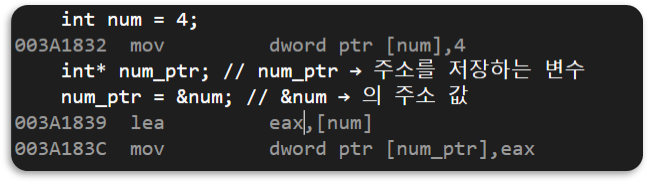
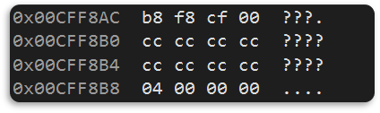
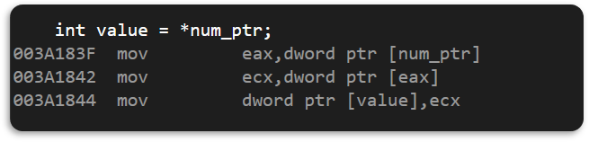
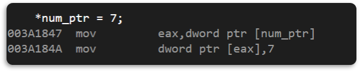
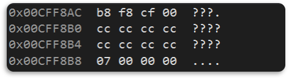
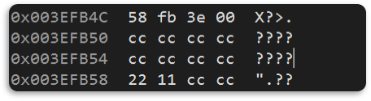
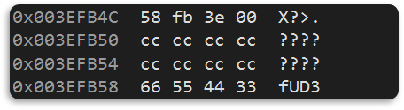
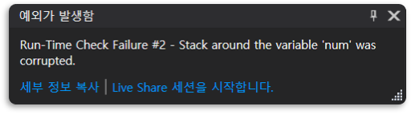

# 0. 포인터
- 변수 또는 상수의 메모리 상의 `주소`를 `저장`하는 것이다.
- 포인터는 `변수 형태의 포인터`와 `상수(const) 형태의 포인터`를 포괄하는 말이다.
- C/C++ 에서는 `시작 주소 값`만을 가지고 위치를 표시한다. (Type에 따라 크기가 정해져 있기 때문에 시작 위치만 알아도 계산이 가능하다.)
- 포인터 변수의 크기는 지정되어 있다. 
  - x84(32bit) : `4 Byte`
  - x64(64bit) : `8 Byte`
<details>
<summary>❔ <span style="color:#fa8072">크기가 지정되어 있으면 왜 타입을 설정해줘야 하는가?</span></summary>
<div markdown="1">
❕ 포인터의 타입은 `메모리 공간`을 `참조`하는 `기준`이 된다.
</div>
</details>

<br>

# 1. 포인터 선언
```c
// 선언 형식
[Type] * [변수 이름];
// ----------------------------
// 사용 예시
int num = 4;
int * num_ptr; // num_ptr → 주소를 저장하는 변수
num_ptr = &num; // &num → 의 주소 값
```

- 어셈블리 언어  
  
- 결과   
  
  > 0x0093FBE8 : `num_ptr`의 주소 값 (num의 주소 값을 저장하고 있다는 것을 알 수 있다.)  
  > 0x0093FBF4 : `num`의 주소 값 (4를 저장하고 있다.)

<br>

# 2. 포인터 사용법
```c
// 포인터가 가르키는 값 가져오기
* [변수이름]
// ----------------------------
// 사용 예시
int value = * num_ptr;
```
- 어셈블리 언어  
  
- 결과  
   


```c
// 포인터가 가르키는 값 변경하기
// 사용예시
*num_ptr = 7;
// 
```
- 어셈블리 언어  
 
- 결과  
 

<br>

# 3. 포인터 타입
- 포인터의 타입은 `해당 주소에 대한 타입`을 의미한다.
- 포인터의 타입은 메모리 공간을 참조하는 기준이 된다.

```c
// 예시 코드
short num = 0x11223344;
int* a_ptr = (int*)&num; // --> 1
*a_ptr = 0x33445566; // --> 2
```
  - 1 결과  
    
  - 2 결과
    
    > 데이터가 할당된 메모리 영역 밖에 까지 침범한다.
    > 

<br>

# 📑. 참고
* [윤성우(2013). 윤성우의 열혈 C 프로그래밍. 서울:오렌지미디어.](https://www.orentec.co.kr/booklist/C_BASIC_2/book_sub1.php)
* [Rookiss. [C++과 언리얼로 만드는 MMORPG 게임 개발 시리즈]Part1: C++ 프로그래밍 입문. Inflearn.](https://www.inflearn.com/course/%EC%96%B8%EB%A6%AC%EC%96%BC-3d-mmorpg-1/dashboard)
