# 0. 기본 셋팅
```c++
class Other
{
    public:
        Other() { cout << "Other()" << endl; }
        ~Other() {cout << "~Other()" << endl; }
};

class Base
{
    public:
        int value = 0xAA;
        Other* other = nullptr;
};

```

```c++
int main()
{
    Derived d1; // 원본

    Derived d2 = d1; // 복사 생성자
    Derived d3(d1); // 복사 생성자

    Derived d4; // 기본 생성자
    d4 = d1; // 복사 대입 연산자

    return 0;
}
```

<br>

# 1. 얕은 복사 (**Shallow Copy**)
- 멤버 데이터를 비트열 단위로 `똑같이` 복사 (메모리 영역 값을 `그대로` 복사)

```c++
class Derived : public Base
{
    public:
        Derived() { other = new Other(); }
        ~Derived() { delete other; }
};
```

- &d1  
  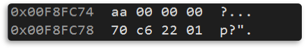
- &d2  
  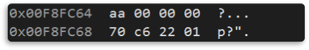
- &d3  
  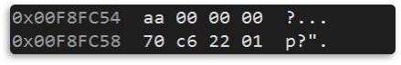
- &d4  
  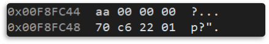
  > 같은 `주소값`을 `공유`한다. 
  > 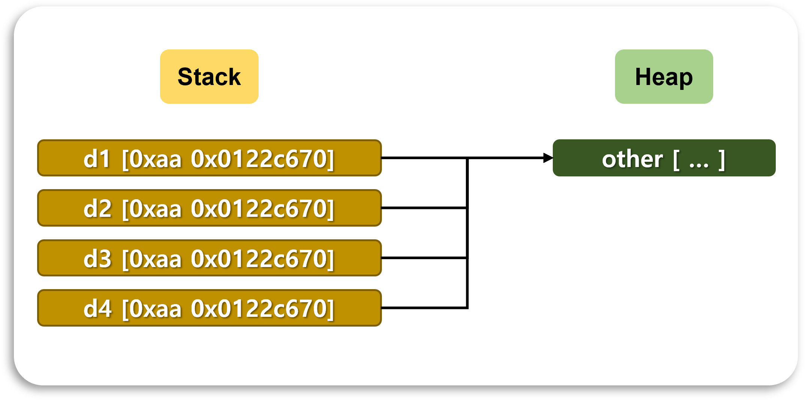

<br>

- ⚠ 문제점
  > 모두 같은 주소를 가리키고 있기 때문에, 값이 변경되는 경우, d1, d2, d3, d4의 값이 모두 변경된다.
  
<br>

# 2. 깊은 복사 (**Deep Copy**)
- 멤버 데이터가 참조(주소) 값이라면 데이터를 새로 생성 (원본 객체가 참조하는 대상까지 `만들어서` 복사)

```c++
class Other
{
    public:
        …
        Other(const Other& o) { cout << "Other(const Other&)" << endl; }
        …
};

class Derived : public Base
{
    public:
        …
        Derived(const Derived& d)
        {
            value = d.value;
            other = new Other(*(d.other)); // 새로운 객체 생성         
        }

        Derived& operator=(const Derived& d)
        {
            value = d.value;
            other = new Other(*(d.other)); // 새로운 객체 생성
            return *this;
        }
        …
};
```

- &d1  
  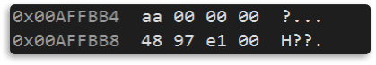
- &d2  
  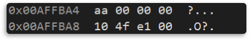
- &d3  
  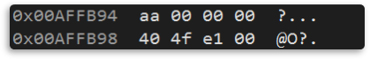
- &d4  
  
  > `다른` 주소값을 가진다.
  > 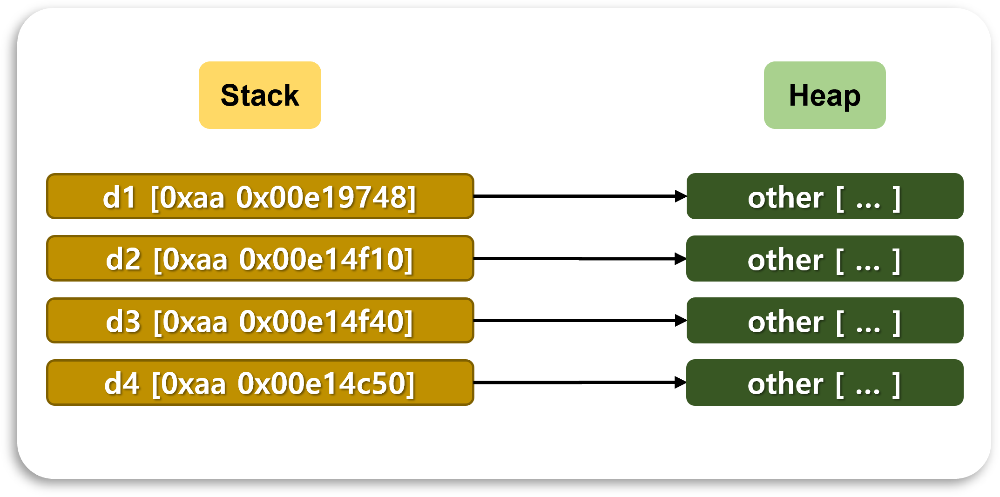


<br>

# 3. 호출 순서
```c++
class Member
{
    public:
        Member() { cout << "Member()" << endl; }
        Member(const Member& m) { cout << "Member(const Member&)" << endl; }
        ~Member() { cout << "~Member()" << endl; }

        Member& operator= (const Member& m) 
        { 
            cout << "operator= (const Member&)" << endl; 
            return *this;
        }
};

class Base
{
    public:
        Base() { cout << "Base()" << endl; }
        Base(const Base& b) 
        { 
            cout << "Base(const Base&)" << endl;  
            num = b.num; 
        }
        ~Base() { cout << "~Base()" << endl; }

        Base& operator= (const Base& b) 
        { 
            cout << "operator(const Base&)" << endl; 
            num = b.num; 
            return *this; 
        }
    public:
        int num = 0;
};
```

<br>

## 1. 복사 생성자
### 1. **암시적 복사 생성자** 순서  
   1) `기본` 클래스의 복사 생성자 호출  
   2) `멤버` 클래스의 복사 생성자 호출  
   3) 멤버가 기본 타입일 경우 메모리 복사 (`얕은 복사`)  
   
```c++
class Derived : public Base
{
    public:
        Derived() { cout << "Derived()" << endl; }
        ~Derived() { cout << "~Derived()" << endl; }
    public:
        Member m; 
};
```

 - 결과  
 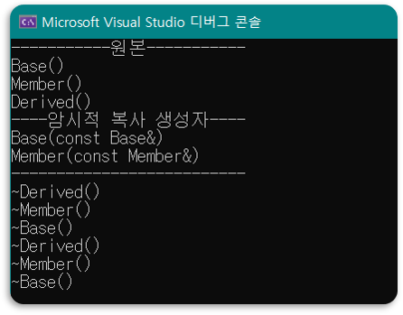

<br>

### 2. **명시적 복사 생성자** 순서  
   1) `기본` 클래스의 기본 생성자 호출  
   2) `멤버` 클래스의 기본 생성자 호출  
   > 부모, 멤버 클래스 값이 **복사되지 않는다**.  
   > 모든 복사의 책임은 프로그래머가 가진다.  

```c++
class Derived : public Base
{
    public:
        Derived() { cout << "Derived()" << endl; }
        ~Derived() { cout << "~Derived()" << endl; }

        Derived(const Derived& d) {cout << "Derived(const Derived&)" << endl; }
    public:
        Member m; 
};
```

 - 결과  
 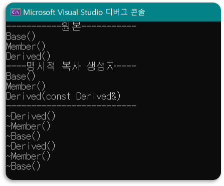
 - ⚠ 문제점 
     > 부모, 멤버 클래스의 기본 생성자 호출  
     > 부모, 멤버 클래스의 값이 복사되지 않는다  

 - 부모, 멤버 클래스 생성자 지정
     ```c++
     class Derived : public Base
     {
         public:
             Derived() { cout << "Derived()" << endl; }
             ~Derived() { cout << "~Derived()" << endl; }

             Derived(const Derived& d) : Base(d), m(d.m) // 생성자 지정 필요
             {
                 cout << "Derived(const Derived&)" << endl; 
             }
         public:
             Member m; 
     };
     ```
 - 결과  
 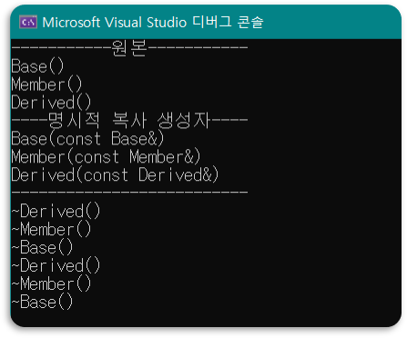

<br>

## 2. 복사 대입 연산자  
### 1. **암시적 복사 대입 연산자** 순서  
   1) `기본` 클래스의 복사 대입 연산자 호출  
   2) `파생` 클래스의 복사 대입 연산자 호출  
   3) 멤버가 기본 타입일 경우 메모리 복사 (`얕은 복사`)  

```c++
class Derived : public Base
{
    public:
        Derived() { cout << "Derived()" << endl; }
        ~Derived() { cout << "~Derived()" << endl; }
    public:
        Member m; 
};
```
- 결과  
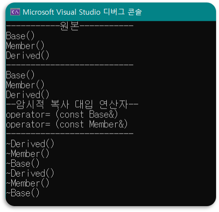

<br>

### 2. **명시적 복사 대입 연산자** 순서  
   \- 알아서 해주는 것 없음  
```c++
class Derived : public Base
{
    public:
        Derived() { cout << "Derived()" << endl; }
        ~Derived() { cout << "~Derived()" << endl; }

        Derived& operator= (const Derived& d)
        {
            cout << "Derived(const Derived&)" << endl;
            return *this;
        }
    public:
        Member m; 
};
```
- 결과  
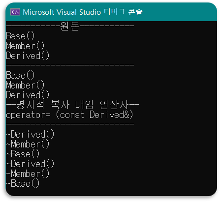

<br>

# 📑. 참고
* [황기태(2013). (명품)C++ Programming. 파주:생능출판사.](https://www.booksr.co.kr/html/book/book.asp?seq=697053)
* [Rookiss. [C++과 언리얼로 만드는 MMORPG 게임 개발 시리즈]Part1: C++ 프로그래밍 입문. Inflearn.](https://www.inflearn.com/course/%EC%96%B8%EB%A6%AC%EC%96%BC-3d-mmorpg-1/dashboard)

