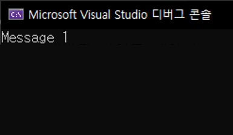

# 0. 예제
```cpp
...
void SetMessage(const char* msg)
{
    msg = "Message 2";
}

int main()
{
    const char* msg = "Message 1";
    SetMessage(msg);
    cout << msg;

    return 0;
}
```
- 결과  
  msg의 값이 바뀌지 않는다.  
  
- 이유  
  SetMessage의 매개변수 msg의 값은 함수가 return되면 stack에서 해제되어 변경값은 사라진다.  
  (msg가 가리키는 값이 Message 1 인 것은 변함없다.)  

# 1. 다중 포인터(**)
```cpp
...
void SetMessage(const char** p_msg)
{
    *p_msg = "Message 2";
}

int main()
{
    const char* msg = "Message 1";
    SetMessage(&msg);
    cout << msg;

    return 0;
}
```
- 결과  
  
const char* 를 T로 치환해서 생각해 보면 쉽게 이해 할 수 있다.


<br>

# 📑. 참고
* [윤성우(2013). 윤성우의 열혈 C 프로그래밍. 서울:오렌지미디어.](https://www.orentec.co.kr/booklist/C_BASIC_2/book_sub1.php)
* [Rookiss. [C++과 언리얼로 만드는 MMORPG 게임 개발 시리즈]Part1: C++ 프로그래밍 입문. Inflearn.](https://www.inflearn.com/course/%EC%96%B8%EB%A6%AC%EC%96%BC-3d-mmorpg-1/dashboard)