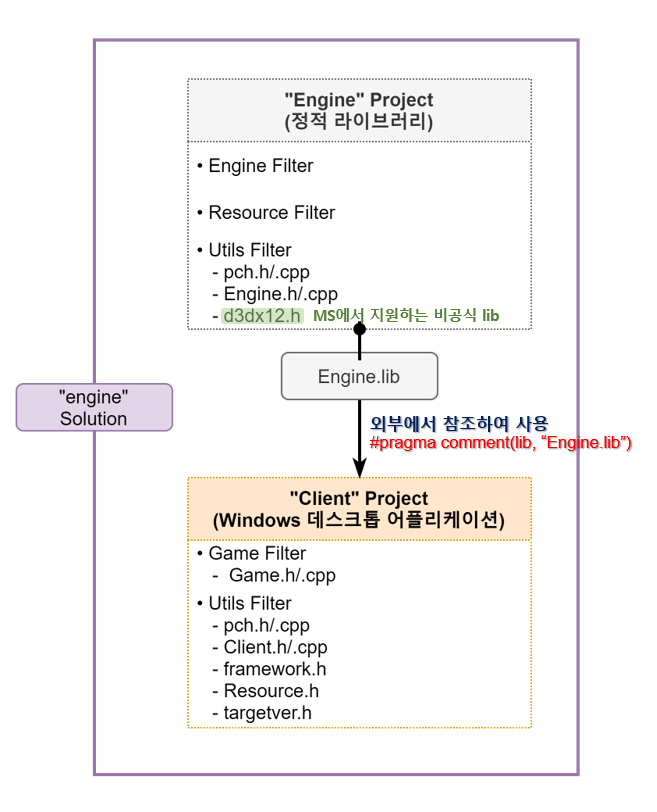
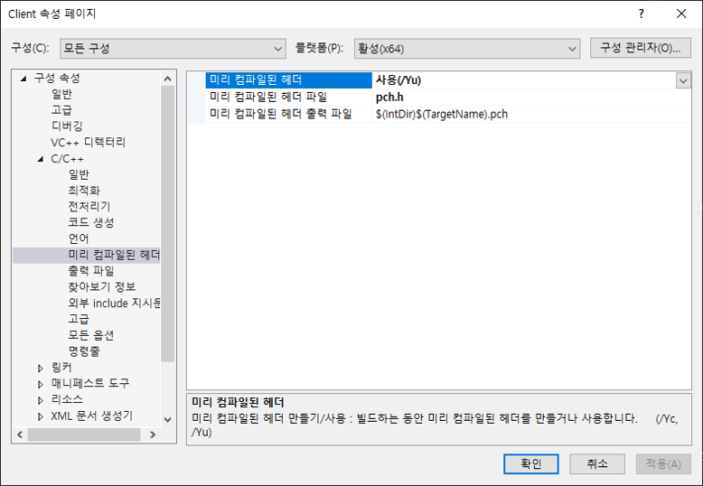
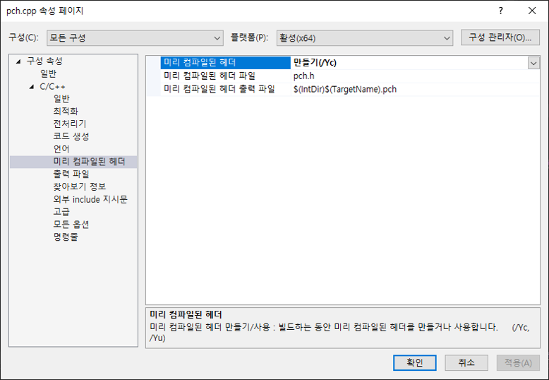
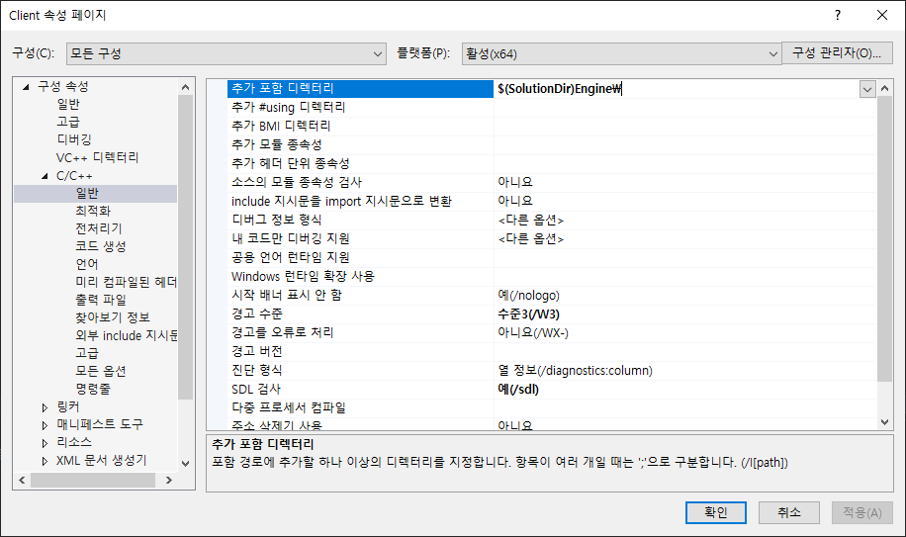
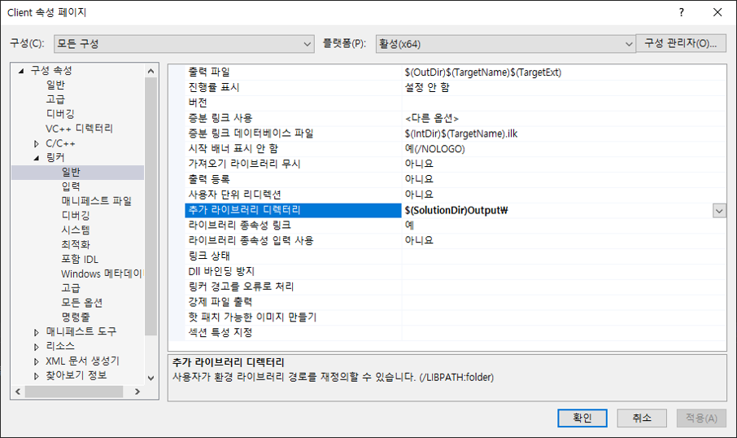
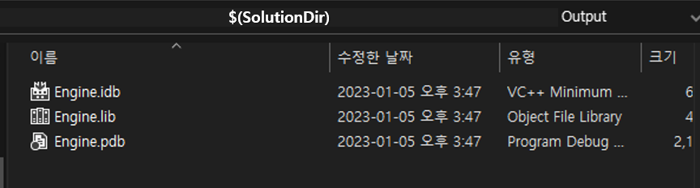
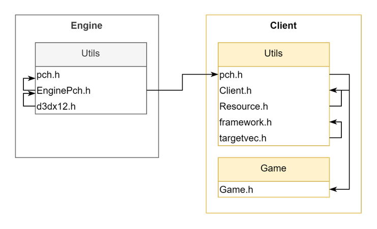

# 🔷 프로젝트 설정
## 🔹 프로젝트 초기 설정


<br>

## 🔹 미리 컴파일된 헤더(pch.h/.cpp) 만들기
- 사용 시, 무조건 미리 컴파일된 헤더(pch.h)를 포함(`#include "pch.h"`)해야 한다.

### 1. 미리 컴파일된 헤더를 만들 `프로젝트(Client)` 설정
- [프로젝트 속성 페이지] 구성 속성 > c/c++ > 미리 컴파일된 헤더  
    - 미리 컴파일된 헤더 : 사용(/Yu)  
    - 미리 컴파일된 헤더 파일 : pch.h `[미리 컴파일된 헤더로 쓸 파일명]`  
    

### 2. 미리 컴파일된 헤더 `c++파일(pch.cpp)` 설정
- [프로젝트 속성 페이지] 구성 속성 > c/c++ > 미리 컴파일된 헤더
    - 미리 컴파일된 헤더 : 만들기(/Yu)  
    

<br>

## 🔹 참조 디렉터리 설정
- Client 프로젝트에서 Engine 프로젝트의 산출물(Engine.lib)을 참조하는 방법  
    1. `VC++디렉터리`로 설정하는 방법  
    2. `c/c++ > 일반`과 `링커 > 일반`으로 설정하는 방법 (✔)  

### 1. 참조하는 헤더(.h)와 C++(.cpp)파일 경로 설정  
- [프로젝트 속성 페이지] 구성 속성 > c/c++ > 일반  
    - 추가 포함 디렉터리 : $(SolutionDir)Engine\ `[참조하는 헤더, C++파일 경로]`  
    
    

### 2. 참조하는 라이브러리(.lib)파일 경로 설정  
- [프로젝트 속성 페이지] 구성 속성 > 링커 > 일반  
    - 추가 라이브러리 디렉터리 : $(SolutionDir)Output\ `[참조하는 라이브러리 파일 경로]`
    
    
    
- 사용하는 라이브러리 명시
    1. [프로젝트 속성 페이지] 구성 속성 > 링커 > 입력
        - 추가 속성 : Engine.lib `[참조하는 라이브러리 파일명]`
    2.  #pragma comment(lib, "Engine.lib") `(Client의 pch.h에 참조)`
  
<br>

## 🔹 d3dx12.h 파일
- Microsoft에서 지원해주는 비공식 lib이다.  
- [microsoft_git](https://github.com/microsoft/DirectX-Graphics-Samples/blob/master/Libraries/D3D12RaytracingFallback/Include/d3dx12.h)에서 다운로드 가능하다.  

<br>

## 🔹 EnginePch.h 설정
```cpp
    // 엔진을 구현할 때 필요한 파일을 모두 참조
    #pragma once

    #include <windows.h>
    #include <tchar.h>
    #include <memory>
    #include <string>
    #include <vector>
    #include <array>
    #include <list>
    #include <map>
    using namespace std;

    #include "d3dx12.h"
    #include <d3d12.h>
    #include <wrl.h>
    #include <d3dcompiler.h>
    #include <dxgi.h>
    #include <DirectXMath.h>
    #include <DirectXPackedVector.h>
    #include <DirectXColors.h>
    using namespace DirectX;
    using namespace DirectX::PackedVector;
    using namespace Microsoft::WRL;

    #pragma comment(lib, "d3d12")
    #pragma comment(lib, "dxgi")
    #pragma comment(lib, "dxguid")
    #pragma comment(lib, "d3dcompiler")

    using int8 = __int8;
    using int16 = __int16;
    using int32 = __int32;
    using int64 = __int64;
    using uint8 = unsigned __int8;
    using uint16 = unsigned __int16;
    using uint32 = unsigned __int32;
    using uint64 = unsigned __int64;
    using Vec2 = XMFLOAT2;
    using Vec3 = XMFLOAT3;
    using Vec4 = XMFLOAT4;
    using Matrix = XMMATRIX;
```

<br>

## 🔹 프로젝트 참조 설정


<br>

# 📑. 참고
* [Rookiss. [C++과 언리얼로 만드는 MMORPG 게임 개발 시리즈]Part2: 게임 수학과 DirectX12. Inflearn.](https://www.inflearn.com/course/%EC%96%B8%EB%A6%AC%EC%96%BC-3d-mmorpg-2/dashboard)