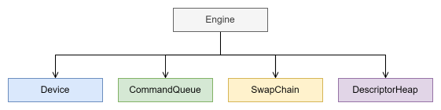
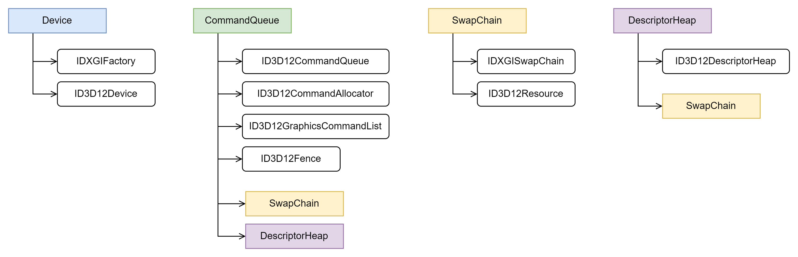
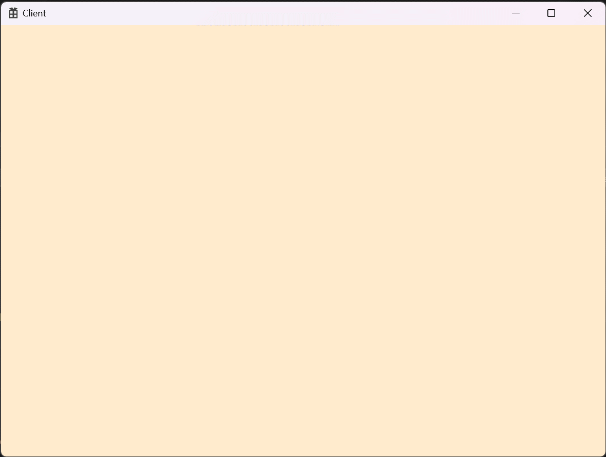

# 🔷 초기화
## 🔹 Engine Class
- 엔진의 핵심적인 기능을 담당하는 클래스

```cpp
class Engine
{
public:
    void Init(const HWND& hwnd, const int32 width, const int32 height, bool windowed);

public:
    void Start();	// 객체를 그려주기 전 CommandQueue를 설정하는 부분
    void End();		// 그려 줄 객체를 모두 설정한 뒤 CommandQueue를 닫아주는 부분
    ...

private:
    ...
    // 그려질 화면 크기 정보를 가짐
	D3D12_VIEWPORT	_viewport = {};		
	D3D12_RECT	_scissorRect = {};	

	shared_ptr<class Device>		_device;
	shared_ptr<class CommandQueue>		_cmdQueue;
	shared_ptr<class SwapChain>		_swapChain;
	shared_ptr<class DescriptorHeap>	_descHeap;
};
```

```cpp
void Engine::Init(const HWND& hwnd, const int32 width, const int32 height, bool windowed)
{
    ...
    // 그려질 화면 크기 설정
	_viewport = { 0,0,static_cast<FLOAT>(window.width), static_cast<FLOAT>(window.height), 0.0f, 1.0f };
	_scissorRect = CD3DX12_RECT(0, 0, window.width, window.height);
	// Device, CommandQueue, SwapChain, DescriptorHeap 생성
	_device = make_shared<Device>();
	_cmdQueue = make_shared<CommandQueue>();
	_swapChain = make_shared<SwapChain>();
	_descHeap = make_shared<DescriptorHeap>();
	// Device, CommandQueue, SwapChain, DescriptorHeap 초기화
	_device->Init();
	_cmdQueue->Init(_device->GetDevice(), _swapChain, _descHeap);
	_swapChain->Init(window, _device->GetDXGI(), _cmdQueue->GetCommandQueue());
	_descHeap->Init(_device->GetDevice(), _swapChain);
}

void Engine::Start()
{
	_cmdQueue->RenderBegin(&_viewport, &_scissorRect);
}

void Engine::End()
{
	_cmdQueue->RenderEnd();
}
```

<br>

## 🔹 Device Class
- 각종 객체를 생성할 수 있는 device와 _dxgi를 관리하는 클래스  
- 인력 사무소  

```cpp
class Device
{
public:
	void Init();
	...
private:
	...
	ComPtr<IDXGIFactory>	_dxgi;		// 화면 관련 기능
	ComPtr<ID3D12Device>	_device;	// 각종 객체 생성 (GPU)
};
```
---

1) [IDXGIFactory](https://learn.microsoft.com/ko-kr/windows/win32/api/dxgi/nn-dxgi-idxgifactory) 선언
- 전체 화면 전환을 처리하는 DXGI 개체릴 생성하는 메서드를 구현
```cpp
::CreateDXGIFactory(IID_PPV_ARGS(&_dxgi));
```

2) [ID3D12Device](https://learn.microsoft.com/ko-kr/windows/win32/api/d3d12/nn-d3d12-id3d12device) 선언
- 가상 어댑터  
- command allocator, command list, command queue, fence, resource, pipeline state object, heap, root signature, sampler, resource view ... 생성 가능  
```cpp
::D3D12CreateDevice(nullptr, D3D_FEATURE_LEVEL_11_0, IID_PPV_ARGS(&_device));
```
---

<br>

## 🔹 CommandQueue Class
- 렌더링 전·후에 대한 처리와 명령에 대한 정보를 가지는 클래스  
- 외주 일감 목록  
> GPU엔 명령 대기열(Command Queue)가 1개 존재한다.  
> CPU는 그리기 명령이 담긴 명령 목록(Command List)을 DirectX API를 통해 대기열에 제출한다.  
> 하지만, 명령은 제출하는 즉시 시행되지 않는다.  

```cpp
class CommandQueue
{
public: 
	void Init(ComPtr<ID3D12Device> device, shared_ptr<SwapChain> swapChain, shared_ptr<DescriptorHeap> descHeap);
    ...

public:
	void WaitSync(); // CPU와 GPU 동기화 함수
	void RenderBegin(const D3D12_VIEWPORT* viewport, const D3D12_RECT* rect); // 명령 입력 전 처리
	void RenderEnd(); // 명력 입력 끝 처리
	...

private:
	ComPtr<ID3D12CommandQueue>			_cmdQueue;
	ComPtr<ID3D12CommandAllocator>		_cmdAlloc;
	ComPtr<ID3D12GraphicsCommandList>	_cmdList;

	ComPtr<ID3D12Fence>				_fence;
	uint32							_fenceValue = 0; // 시간상의 특정 울타리 지점을 식별하는 정수

	...
};
```
---
1) [ID3D12CommandQueue](https://learn.microsoft.com/ko-kr/windows/win32/api/d3d12/nn-d3d12-id3d12commandqueue) 선언  
- 명령 목록을 제출  
- 명령 목록 동기화  
- 명령 큐 계측  
- 리소스 타일 매핑을 업데이트하는 메서드 제공  

2) [ID3D12CommandAllocator](https://learn.microsoft.com/ko-kr/windows/win32/api/d3d12/nn-d3d12-id3d12commandallocator) 선언  
- GPU 명령에 대한 스토리지 할당  
- 명령 목록에 추가된 명령들은 이 할당자의 메모리에 저장된다.  
- 여러 명령 목록을 연관시켜도 되지만, 기록중인 명력 목록 외에는 전부 Close()되어야 한다.

3) [ID3D12GraphicsCommandList](https://learn.microsoft.com/ko-kr/windows/win32/api/d3d12/nn-d3d12-id3d12graphicscommandlist) 선언  
- 렌더링을 위한 그래픽 명령 목록을 캡슐화
- 명령 목록 실행을 계측
- 파이프라인 상태 설정 및 지우기

```cpp
D3D12_COMMAND_QUEUE_DESC queueDesc = {};
queueDesc.Type = D3D12_COMMAND_LIST_TYPE_DIRECT;
queueDesc.Flags = D3D12_COMMAND_QUEUE_FLAG_NONE;

device->CreateCommandQueue(&queueDesc, IID_PPV_ARGS(&_cmdQueue));	// ID3D12CommandQueue
device->CreateCommandAllocator(D3D12_COMMAND_LIST_TYPE_DIRECT, IID_PPV_ARGS(&_cmdAlloc));	// ID3D12CommandAllocator
device->CreateCommandList(0, D3D12_COMMAND_LIST_TYPE_DIRECT, _cmdAlloc.Get(), nullptr, IID_PPV_ARGS(&_cmdList));	// ID3D12GraphicsCommandList
// 명령 기록이 끝났음을 기록한다.
_cmdList->Close();
```

4) [ID3D12Fence](https://learn.microsoft.com/ko-kr/windows/win32/api/d3d12/nn-d3d12-id3d12fence) 선언
- CPU 동기화에 사용되는 개체 및 하나 이상의 GPU를 나타냄
- 대기열에 울타리를 쳐서 명령을 처리한다.
- 시간상의 특정 울타리 지점을 식별하는 정수(UINT64)값을 관리  

```cpp
device->CreateFence(0, D3D12_FENCE_FLAG_NONE, IID_PPV_ARGS(&_fence));	// Fence 생성
_fenceEvent = ::CreateEvent(nullptr, FALSE, FALSE, nullptr);	
```

---


1) 렌더링 전 필요한 명력을 _cmdList에 추가하는 작업

```cpp
// (1) _cmdAlloc과 _cmdList를 처음 생성했을 때와 같은 상태로 만든다.
// ⚠️ _cmdAlloc은 GPU가 명령 할당자에 담긴 모든 명령을 실행했을이 확실하기 전까진 재설정하지 않는다.
_cmdAlloc->Reset();
_cmdList->Reset(_cmdAlloc.Get(), nullptr);

// (2) 자원 상태 전이
D3D12_RESOURCE_BARRIER barrier = CD3DX12_RESOURCE_BARRIER::Transition(
	_swapChain->GetCurrentBackBufferResource().Get(),
	D3D12_RESOURCE_STATE_PRESENT,
	D3D12_RESOURCE_STATE_RENDER_TARGET);
_cmdList->ResourceBarrier(1, &barrier);

(3) ViewPort, ScissorRect 설정
_cmdList->RSSetViewports(1, viewport);	// 뷰포트 설정
_cmdList->RSSetScissorRects(1, rect);	// 가위 직사각형 설정

// 화면 뒷 배경 설정
D3D12_CPU_DESCRIPTOR_HANDLE backBufferView = _descHeap->GetBackBufferView();
_cmdList->ClearRenderTargetView(backBufferView, Colors::BlanchedAlmond, 0, nullptr);	// 렌더 대상 뷰 지우기
_cmdList->OMSetRenderTargets(1, &backBufferView, FALSE, nullptr);	// 렌더링 대상 및 깊이 스텐실에 대한 CPU 설명자 핸들을 설정
```

> `자원 상태 전이(transition resource barrier)`  
> - 자원 위험 상황(resource hazard)를 방지하기 위해 개발자가 자원의 상태를 설정해 준다.
> - 전이 자원 장벽(transition resource barrier)들의 배열을 설정하여 기정한다.  
>> `전이 자원 장벽(transition resource barrier)`  
>> - GPU에게 자원의 상태가 전이됨을 알려주는 하나의 명령

> `뷰포트(viewport)`  
> - 장면을 그려 넣고자 하는 후면 버퍼의 부분직사각형(subrectangle)영역  
> - 명령 목록을 재설정(Reset)하면 뷰포트들도 재설정해야 한다.

> `가위 직사각형(scissor rectangle)`  
> - 특정 픽셀들을 선별(culling)하는 용도로 사용  
> - 렌더링 시 가위 직사각형의 바깥에 있는 픽셀들은 후면 버퍼에 래스터화(픽셀 선별)되지 않는다. (최적화 기법)  
> - 명령 목록을 재설정(Reset)하면 가위 직사각형들도 재설정해야한다.  

2) 모든 명령을 _cmdList에 추가한 뒤의 작업

```cpp
// (1) 자원 상태 전이
D3D12_RESOURCE_BARRIER barrier = CD3DX12_RESOURCE_BARRIER::Transition(
	_swapChain->GetCurrentBackBufferResource().Get(),
	D3D12_RESOURCE_STATE_RENDER_TARGET,
	D3D12_RESOURCE_STATE_PRESENT);
_cmdList->ResourceBarrier(1, &barrier);
// (2) 명령 목록 닫음
_cmdList->Close();

// (3) 명령 목록에 있는 명령들을 대기열에 추가한다.
// 명령 대기열은 명령 목록의 할당자에 담긴 명령들을 참조한다.
ID3D12CommandList* cmdListArr[] = { _cmdList.Get() };
_cmdQueue->ExecuteCommandLists(_countof(cmdListArr), cmdListArr);

// (4) 제시
_swapChain->Present();

// (5) CPU와 GPU 동기화
WaitSync();

// (6) 현재 back buffer 색인을 바꿈
_swapChain->SwapIndex();
```

3) CPU와 GPU 동기화

```cpp
// (1) 새 울타리 지점을 만들 댸 마다 울타리값을 1씩 증가시킴
_fenceValue++;

// (2) Signal 명령 추가
_cmdQueue->Signal(_fence.Get(), _fenceValue);

// (3) 새 울타리 지점은 GPU가 현재 Signal()명령까지의 모든 명령을 처리하지 전까지는 설정되지 않는다.
if (_fence->GetCompletedValue() < _fenceValue)
{
	_fence->SetEventOnCompletion(_fenceValue, _fenceEvent);
	::WaitForSingleObject(_fenceEvent, INFINITE);
}
```

---

<br>

## 🔹 SwaphChain Class
- 화면에 표시 될 정보를 관리하는 클래스  

```cpp
class SwapChain
{
public:
	void Init(const WindowInfo& window, ComPtr<IDXGIFactory> dxgi, ComPtr<ID3D12CommandQueue> cmdQueue);

public:
	void Present();
	void SwapIndex();
	...

private:
	ComPtr<IDXGISwapChain>	_swapChain;
	ComPtr<ID3D12Resource>	_renderTargets[SWAP_CHAIN_BUFFER_COUNT];
	
	...
};
```
---
1) [IDXGISwapChain](https://learn.microsoft.com/ko-kr/windows/win32/api/dxgi/nn-dxgi-idxgiswapchain)
- 렌더링된 데이터를 출력에 표시하기 전에 저장하기 위해 하나 이상의 Surface를 구현  

2) [ID3D12Resource](https://learn.microsoft.com/ko-kr/windows/win32/api/d3d12/nn-d3d12-id3d12resource)
- CPU 및 GPU의 일반화된 기능을 캡슐화하여 실제 메모리 또는 힙을 읽고 쓸 수 있음  
- 셰이더 샘플링에 최적화된 다차원 데이터 뿐만 아니라 간단한 데이터 배열을 구성하고 조작하기 위한 추상화가 포함됨   

```cpp
// (1) 교환사슬 생성
DXGI_SWAP_CHAIN_DESC chainDesc = {};
chainDesc.BufferDesc.Width = static_cast<uint32>(window.width);
chainDesc.BufferDesc.Height = static_cast<uint32>(window.height);
chainDesc.BufferDesc.RefreshRate.Numerator = 60;			// 화면 갱신 비율
chainDesc.BufferDesc.RefreshRate.Denominator = 1;			// 화면 갱신 비율
chainDesc.BufferDesc.Format = DXGI_FORMAT_R8G8B8A8_UNORM;	// 버퍼의 디스플레이 형식
chainDesc.BufferDesc.ScanlineOrdering = DXGI_MODE_SCANLINE_ORDER_UNSPECIFIED;
chainDesc.BufferDesc.Scaling = DXGI_MODE_SCALING_UNSPECIFIED;
chainDesc.SampleDesc.Count = 1;								// 멀티 샘플링 OFF
chainDesc.SampleDesc.Quality = 0;
chainDesc.BufferUsage = DXGI_USAGE_RENDER_TARGET_OUTPUT;	// 후면 버퍼에 렌더링할 것 
chainDesc.BufferCount = SWAP_CHAIN_BUFFER_COUNT;			// 전면+후면 버퍼
chainDesc.OutputWindow = window.hwnd;
chainDesc.Windowed = window.windowed;
chainDesc.SwapEffect = DXGI_SWAP_EFFECT_FLIP_DISCARD;		// 전면 후면 버퍼 교체 시 이전 프레임 정보 버림
chainDesc.Flags = DXGI_SWAP_CHAIN_FLAG_ALLOW_MODE_SWITCH;

dxgi->CreateSwapChain(cmdQueue.Get(), &chainDesc, &_swapChain);

// (2) 렌더링 대상이 되는 버퍼(ID3D12Resource) 가져옴
for (int32 i = 0; i < SWAP_CHAIN_BUFFER_COUNT; i++)
	_swapChain->GetBuffer(i, IID_PPV_ARGS(&_renderTargets[i]));
```

---

1) 그려질 화면을 제시

```cpp
_swapChain->Present(0, 0);
```

2) back buffer를 가리키는 색인 변경 (1->2, 2->1)

```cpp
_backBufferIndex = (_backBufferIndex + 1) % SWAP_CHAIN_BUFFER_COUNT;
```

<br>

## 🔹 DescriptorHeap Class
- 화면에 표시되는 정보(RTV)를 생성하는 클래스  
- 기안서  

```cpp
class DescriptorHeap
{
public:
	void Init(ComPtr<ID3D12Device> device, shared_ptr<class SwapChain> swapChain);
    ...

private:
	ComPtr<ID3D12DescriptorHeap>	_rtvHeap;
	...
};
```
---

1) [ID3D12DescriptorHeap](https://learn.microsoft.com/ko-kr/windows/win32/api/d3d12/nn-d3d12-id3d12descriptorheap)
- 설명자의 연속 할당 컬렉션으로, 모든 설명자에 대한 하나의 할당  
- SRV, UAV, CBV, Sampler (파이프라인 상태 개체(Pipeline State Object:PSO)에 속하지 않은 유형)  

```cpp
// (1) 렌더 대상 뷰(RenderTargetView)의 크기 가져옴 (offset을 위함)
_rtvHeapSize = device->GetDescriptorHandleIncrementSize(D3D12_DESCRIPTOR_HEAP_TYPE_RTV);

// (2) RTV 생성
D3D12_DESCRIPTOR_HEAP_DESC rtvDesc = {};
rtvDesc.Type = D3D12_DESCRIPTOR_HEAP_TYPE_RTV;
rtvDesc.NumDescriptors = SWAP_CHAIN_BUFFER_COUNT;
rtvDesc.Flags = D3D12_DESCRIPTOR_HEAP_FLAG_NONE;
rtvDesc.NodeMask = 0;

device->CreateDescriptorHeap(&rtvDesc, IID_PPV_ARGS(&_rtvHeap));

// (3) 
D3D12_CPU_DESCRIPTOR_HANDLE rtvHeapBegin = _rtvHeap->GetCPUDescriptorHandleForHeapStart();

for (int i = 0; i < SWAP_CHAIN_BUFFER_COUNT; i++)
{
	_rtvHandle[i] = CD3DX12_CPU_DESCRIPTOR_HANDLE(rtvHeapBegin, i * _rtvHeapSize);
	// (4) RTV 생성
	device->CreateRenderTargetView(swapChain->GetRenderTarget(i).Get(), nullptr, _rtvHandle[i]);
}
```

> `Render Target View(RTV)`  
> - 교환사슬에서 렌더링의 대상이 되는 버퍼 자원 서술

<br>

---
## 🔹 참조관계  
  

> DescriptorHeap 클래스를 SwapChain 클래스에 포함하도록 변경하는게 좋을 것 같음

<br>

  

<br>

## 🔹 결과  
  

<br>

# 📑. 참고
* [Rookiss. [C++과 언리얼로 만드는 MMORPG 게임 개발 시리즈]Part2: 게임 수학과 DirectX12. Inflearn.](https://www.inflearn.com/course/%EC%96%B8%EB%A6%AC%EC%96%BC-3d-mmorpg-2/dashboard)
* [프랭크 D. 루나(2020). DirectX 12를 이용한 3D게임 프로그래밍 입문. 한빛미디어(주).](https://www.hanbit.co.kr/store/books/look.php?p_code=B5088646371)