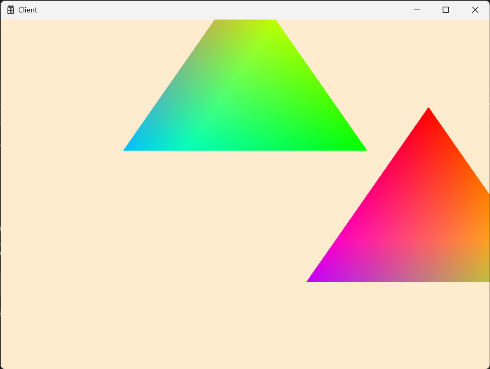

# 🔷 Descriptor Table

## 1. Root Signature에 DescriptorTable 설정

1) 테이블 구성요소 설정
- b0, b1, b2, b3, b4로 구성되도록 설정 

```cpp
CD3DX12_DESCRIPTOR_RANGE range[] =
{
    CD3DX12_DESCRIPTOR_RANGE(D3D12_DESCRIPTOR_RANGE_TYPE_CBV, CBV_REGISTER_COUNT, 0)
};
```

2) 파라미터에 서술자 테이블 생성

```cpp
CD3DX12_ROOT_PARAMETER param[1];
param[0].InitAsDescriptorTable(_countof(range), range);
```

---

<br>

## 2. TableDescriptorHeap Class
- Descriptor Table을 생성 및 관리하는 클래스
> `서술자 테이블(Descriptor Table)`
> - 서술자 힙 안에 있는 연속된 서술자들의 구간을 지정

---

```cpp
ComPtr<ID3D12DescriptorHeap>	_descHeap;
uint64							_handleSize = 0;
uint64							_groupSize = 0;
uint64							_groupCount = 0;

uint32							_currentGroupIndex;
```

1) [ID3D12DescriptorHeap](https://learn.microsoft.com/ko-kr/windows/win32/api/d3d12/nn-d3d12-id3d12descriptorheap)
- 설명자(descriptor)의 연속 할당 컬렉션으로, 모든 설명자에 대한 하나의 할당  
- PSO에 속하지 않는 개체(SRV, UAV, CBV, Sampler)를 포함한다.

---

1) 서술자 힙 생성

```cpp
D3D12_DESCRIPTOR_HEAP_DESC desc = {};
desc.NumDescriptors = count * REGISTER_COUNT;
desc.Flags = D3D12_DESCRIPTOR_HEAP_FLAG_SHADER_VISIBLE;
desc.Type = D3D12_DESCRIPTOR_HEAP_TYPE_CBV_SRV_UAV;

MyEngine->GetDevice()->GetDevice()->CreateDescriptorHeap(&desc, IID_PPV_ARGS(&_descHeap));
```

2) 서술자 힙의 Handle 계산을 위한 값

```cpp
_groupCount = count; // 그룹의 개수

_handleSize = MyEngine->GetDevice()->GetDevice()->GetDescriptorHandleIncrementSize(desc.Type); // CBV 설명자 힙 크기
_groupSize = _handleSize * REGISTER_COUNT; // 그룹의 크기
```

3) CBV를 설명자 테이블에 추가
  - [ID3D12Device::CopyDescriptors](https://learn.microsoft.com/ko-kr/windows/win32/api/d3d12/
nf-d3d12-id3d12device-copydescriptors)  
    - 원본에서 개장으로 설명자를 복사한다.

```cpp
// descHeap의 Handle값을 가져옴
D3D12_CPU_DESCRIPTOR_HANDLE handle = _descHeap->GetCPUDescriptorHandleForHeapStart();
handle.ptr += _currentGroupIndex * _groupSize;
handle.ptr += reg * _handleSize;

// cbHeap의 값을 descHeap으로 복사
uint32 descRange = 1;
uint32 srcRange = 1;
MyEngine->GetDevice()->GetDevice()->CopyDescriptors(1, &handle, &descRange, 1, &srcHandle, &srcRange, D3D12_DESCRIPTOR_HEAP_TYPE_CBV_SRV_UAV);
```

4) 파이프라인에 설명자 테이블 바인딩

```cpp
D3D12_GPU_DESCRIPTOR_HANDLE handle = _descHeap->GetGPUDescriptorHandleForHeapStart();
handle.ptr += _currentGroupIndex * _groupSize;

MyEngine->GetCommandQueue()->GetCommandList()->SetGraphicsRootDescriptorTable(0, handle);
// 다음 데이터와 겹치지 않게 하기 위해 색인을 증가
_currentGroupIndex++;
```

<br>

## 3. ConstantBufferView 생성

```cpp
	ComPtr<ID3D12DescriptorHeap>	_cbvHeap;
	D3D12_CPU_DESCRIPTOR_HANDLE		_cpuHandleBegin = {};
	uint32							_handleIncrementSize = 0;
```

1) CBV 설명자 힙 생성

```cpp
D3D12_DESCRIPTOR_HEAP_DESC desc = {};
desc.NumDescriptors = _elementCount;
desc.Flags = D3D12_DESCRIPTOR_HEAP_FLAG_NONE;
desc.Type = D3D12_DESCRIPTOR_HEAP_TYPE_CBV_SRV_UAV;
MyEngine->GetDevice()->GetDevice()->CreateDescriptorHeap(&desc, IID_PPV_ARGS(&_cbvHeap));

_cpuHandleBegin = _cbvHeap->GetCPUDescriptorHandleForHeapStart();
_handleIncrementSize = MyEngine->GetDevice()->GetDevice()->GetDescriptorHandleIncrementSize(desc.Type);

for (uint32 i = 0; i < _elementCount; ++i)
{
	D3D12_CPU_DESCRIPTOR_HANDLE handle = GetCPUHandle(i);

	D3D12_CONSTANT_BUFFER_VIEW_DESC desc = {};
	desc.BufferLocation = _cbvBuffer->GetGPUVirtualAddress() + static_cast<uint64>(_elementSize) * i;
	desc.SizeInBytes = _elementSize;

	MyEngine->GetDevice()->GetDevice()->CreateConstantBufferView(&desc, handle);
}
```

2) CBV 생성 후 핸들값을 돌려주도록 변경

```cpp
assert(_currentIndex < _elementSize);

::memcpy(&_mappedBuffer[_currentIndex * _elementSize], buffer, size);

//D3D12_GPU_VIRTUAL_ADDRESS address = GetGpuVirtualAddress(_currentIndex);
//MyEngine->GetCommandQueue()->GetCommandList()->SetGraphicsRootConstantBufferView(rootParamIndex, address);

D3D12_CPU_DESCRIPTOR_HANDLE cpuHandle = GetCpuHandle(_currentIndex++);
return cpuHandle;
```

<br>

## 4. CommandQueue 설정

```cpp
// Render Begine 설정
MyEngine->GetTableDescriptorHeap()->Clear();

// TableDescriptorHeap
ID3D12DescriptorHeap* descHeap = MyEngine->GetTableDescriptorHeap()->GetDescriptorHeap().Get();
_cmdList->SetDescriptorHeaps(1, &descHeap);
```

<br>

## 5. Mesh에서 값 설정
```cpp
// 1) Buffer에다가 데이터 세팅
// 2) TableDescHeap에다가 CBV 전달
// 3) 모두 세팅이 끝났으면 TableDescHeap 커밋
{
    D3D12_CPU_DESCRIPTOR_HANDLE handle = MyEngine->GetConstantBuffer()->PushData(0, &_transform, sizeof(_transform));
    MyEngine->GetTableDescriptorHeap()->SetConstantBufferView(handle, CBV_REGISTER::b0);
}
{
    D3D12_CPU_DESCRIPTOR_HANDLE handle = MyEngine->GetConstantBuffer()->PushData(0, &_transform, sizeof(_transform));
    MyEngine->GetTableDescriptorHeap()->SetConstantBufferView(handle, CBV_REGISTER::b1);
}
MyEngine->GetTableDescriptorHeap()->CommitTable();
```
<br>

## 🔹 결과  
  

<br>

# 📑. 참고
* [Rookiss. [C++과 언리얼로 만드는 MMORPG 게임 개발 시리즈]Part2: 게임 수학과 DirectX12. Inflearn.](https://www.inflearn.com/course/%EC%96%B8%EB%A6%AC%EC%96%BC-3d-mmorpg-2/dashboard)
* [프랭크 D. 루나(2020). DirectX 12를 이용한 3D게임 프로그래밍 입문. 한빛미디어(주).](https://www.hanbit.co.kr/store/books/look.php?p_code=B5088646371)