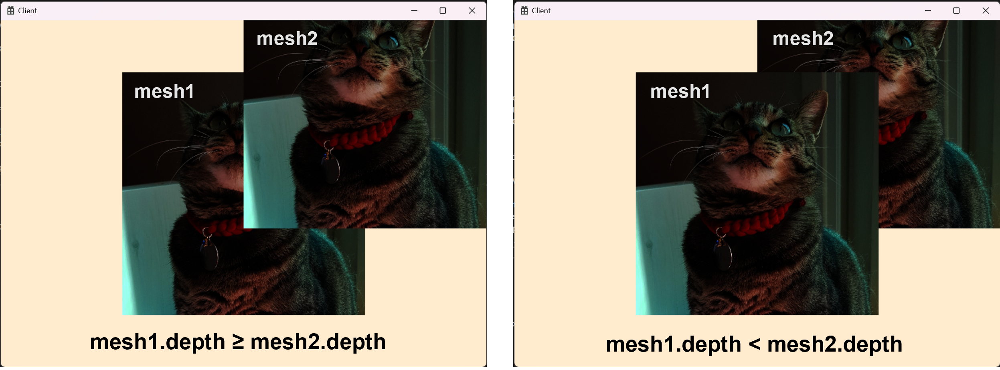

# 🔷 Depth Stencil View

## 1. DepthStencilBuffer 클래스
- 깊이·스텐실 버퍼와 뷰를 생성 및 관리하는 클래스

> `스텐실(Stencil)`
> - 판에 구멍을 뚫고 잉크를 통과시켜 찍어내는 공판화 기법
> - 특정 stencil값을 가지는 픽셀에 대하여 다른 처리를 해줄 때 사용

---

```cpp
ComPtr<ID3D12Resource>			_dsvBuffer;
ComPtr<ID3D12DescriptorHeap>	_dsvHeap;
D3D12_CPU_DESCRIPTOR_HANDLE		_dsvHandle = {};
DXGI_FORMAT						_dsvFormat = {}; // 깊이값을 정확하게 표시하기 위한 형식
```
---

1) 깊이·스텐실 버퍼 생성

```cpp
D3D12_HEAP_PROPERTIES heapProperty = CD3DX12_HEAP_PROPERTIES(D3D12_HEAP_TYPE_DEFAULT);
// window창과 같은 크기로 설정
D3D12_RESOURCE_DESC desc = CD3DX12_RESOURCE_DESC::Tex2D(_dsvFormat, window.width, window.height);
desc.Flags = D3D12_RESOURCE_FLAG_ALLOW_DEPTH_STENCIL;
// 자원 지우기에 최적화된 값 설정
// ❗ 최적화된 지우기 값과 부합하는 지우기 호출은 부합하지 않는 호출보다 빠를 수 있다.
D3D12_CLEAR_VALUE optimizedClearValue = CD3DX12_CLEAR_VALUE(_dsvFormat, 1.f, 0);

ComPtr<ID3D12Device> device = MyEngine->GetDevice()->GetDevice();
device->CreateCommittedResource(
    &heapProperty,
    D3D12_HEAP_FLAG_NONE,
    &desc,
    D3D12_RESOURCE_STATE_DEPTH_WRITE,
    &optimizedClearValue,
    IID_PPV_ARGS(&_dsvBuffer));
```

2) 설명자 힙과 뷰 생성

```cpp
// Create heap
D3D12_DESCRIPTOR_HEAP_DESC heapDesc = {};
heapDesc.NumDescriptors = 1;
heapDesc.Flags = D3D12_DESCRIPTOR_HEAP_FLAG_NONE;
heapDesc.Type = D3D12_DESCRIPTOR_HEAP_TYPE_DSV;
device->CreateDescriptorHeap(&heapDesc, IID_PPV_ARGS(&_dsvHeap));

_dsvHandle = _dsvHeap->GetCPUDescriptorHandleForHeapStart();
// Create view
device->CreateDepthStencilView(_dsvBuffer.Get(), nullptr, _dsvHandle);
```

<br>

## 2. 렌더링 전 DSV 처리

```cpp
D3D12_CPU_DESCRIPTOR_HANDLE depthStencilView = MyEngine->GetDepthStencilBuffer()->GetCpuHandle();
_cmdList->OMSetRenderTargets(1, &backBufferView, FALSE, &depthStencilView);
// 1.f 는 최적화된 초기화 값이다.
_cmdList->ClearDepthStencilView(depthStencilView, D3D12_CLEAR_FLAG_DEPTH, 1.f, 0, 0, nullptr);
```

<br>

## 3. Shader에서 DSV 사용 입력

```cpp
//_pipelineDesc.DepthStencilState.DepthEnable = FALSE;
//_pipelineDesc.DepthStencilState.StencilEnable = FALSE;
_pipelineDesc.DepthStencilState = CD3DX12_DEPTH_STENCIL_DESC(D3D12_DEFAULT);
_pipelineDesc.DSVFormat = MyEngine->GetDepthStencilBuffer()->GetFormat();
```

<br>

## 🔹 결과  
  

<br>

# 📑. 참고
* [Rookiss. [C++과 언리얼로 만드는 MMORPG 게임 개발 시리즈]Part2: 게임 수학과 DirectX12. Inflearn.](https://www.inflearn.com/course/%EC%96%B8%EB%A6%AC%EC%96%BC-3d-mmorpg-2/dashboard)
* [프랭크 D. 루나(2020). DirectX 12를 이용한 3D게임 프로그래밍 입문. 한빛미디어(주).](https://www.hanbit.co.kr/store/books/look.php?p_code=B5088646371)