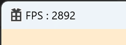

# 🔷 Input

## Input class
- 응용프로그램의 키보드 입력에 대한 처리를 담당하는 클래스

```cpp
enum class KEY_TYPE
{
	UP = VK_UP,
	DOWN = VK_DOWN,
	LEFT = VK_LEFT,
	RIGHT = VK_RIGHT,

	W = 'W',
	A = 'A',
	S = 'S',
	D = 'D',
};

enum class KEY_STATE
{
	NONE,
	PRESS,
	DOWN,
	UP,

	END
};

enum
{
	KEY_TYPE_COUNT = static_cast<int32>(UINT8_MAX + 1),
	KEY_STATE_COUNT = static_cast<int32>(KEY_STATE::END),
};
```

```cpp
HWND				_hwnd;
vector<KEY_STATE>	_states;
_states.resize(KEY_TYPE_COUNT, KEY_STATE::NONE);
```

---

1) 현재 키보드 입력에 대한 상태(_state) 업데이트

```cpp
HWND hwnd = ::GetActiveWindow();
if (_hwnd != hwnd)
{
    for (int32 key = 0; key < KEY_TYPE_COUNT; key++)
        _states[key] = KEY_STATE::NONE;

    return;
}

BYTE asciiKeys[KEY_TYPE_COUNT] = {};
// 256개의 가상 키 상태를 지정된 버퍼에 복사
if (::GetKeyboardState(asciiKeys) == false)
    return;

for (uint32 key = 0; key < KEY_TYPE_COUNT; key++)
{
    if (asciiKeys[key] & 0x80)
    {
        // 1) Key가 눌려 있음
        KEY_STATE& state = _states[key];
        
        if (state == KEY_STATE::PRESS || state == KEY_STATE::DOWN)
            state = KEY_STATE::PRESS;   // 이전 프레임에 Key를 누른 상태
        else
            state = KEY_STATE::DOWN;    // 이전 프레임에 Key를 누르지 않은 상태
    }
    else
    {
        // 2) Key가 눌려있지 않음
        KEY_STATE& state = _states[key];

        if (state == KEY_STATE::PRESS || state == KEY_STATE::DOWN)
            state = KEY_STATE::UP;      // 이전 프레임에 Key를 누른 상태
        else
            state = KEY_STATE::NONE;    // 이전 프레임에 Key를 누르지 않은 상태
    }
}
```

[GetKeyboardState](https://learn.microsoft.com/ko-kr/windows/win32/api/winuser/nf-winuser-getkeyboardstate)  
- 256개의 가상 키 상태를 지정된 버퍼에 복사


2) UI에 FPS 표시

```cpp
uint32 fps = _timer->GetFPS();

WCHAR text[100] = L"";
::wsprintf(text, L"FPS : %d", fps);

::SetWindowText(_window.hwnd, text);
```

3) 객체이동 적용
- Transform을 통해 상수버퍼 값으로 전달

```cpp
shared_ptr<Input> input = MyEngine->GetInput();
float deltaTime = MyEngine->GetTimer()->GetDeltaTime();

if (input->IsButtonPress(KEY_TYPE::W))
    trans.offset.y += 1.f * deltaTime;
if (input->IsButtonPress(KEY_TYPE::S))
    trans.offset.y -= 1.f * deltaTime;
if (input->IsButtonPress(KEY_TYPE::A))
    trans.offset.x -= 1.f * deltaTime;
if (input->IsButtonPress(KEY_TYPE::D))
    trans.offset.x += 1.f * deltaTime;
```

<br>

# 🔷 Timer

## Timer class

```cpp
uint64	_frequency = 0;
::QueryPerformanceFrequency(reinterpret_cast<LARGE_INTEGER*>(&_frequency));
uint64	_prevCount = 0;
float	_deltaTime = 0.f;   // 한 프레임이 진행하는데 걸리는 시간

uint32	_frameCount = 0;
::QueryPerformanceCounter(reinterpret_cast<LARGE_INTEGER*>(&_prevCount));
float	_frameTime = 0.f;
uint32	_fps = 0; // 초당 프레임
```

1) [QueryPerformanceFrequency](https://learn.microsoft.com/ko-kr/windows/win32/api/profileapi/nf-profileapi-queryperformancefrequency)
- 성능 카운터의 빈도를 검색한다.  
- 성능 카운터의 빈도는 시스템 부팅 시 고정되며 모든 프로세서에서 일관된다.  
- 따라서, 빈도는 애플리케이션 초기화 시만 쿼리해야 하며 결과를 캐시할 수 있다.

2) [QueryPerformanceCounter](https://learn.microsoft.com/ko-kr/windows/win32/api/profileapi/nf-profileapi-queryperformancecounter)
- 시간 간격 측정에 사용할 수 있는 고해상도(<1us) 타임스탬프를 나타내는 성능 카운터의 현재 값을 검색한다.

---

- DeltaTime과 FPS 계산

```cpp
uint64 currentCount;
::QueryPerformanceCounter(reinterpret_cast<LARGE_INTEGER*>(&currentCount));

_deltaTime = (currentCount - _prevCount) / static_cast<float>(_frequency);
_prevCount = currentCount;

_frameCount++;
_frameTime += _deltaTime;

if (_frameTime >= 1.f)
{
    _fps = static_cast<uint32>(_frameCount / _frameTime);

    _frameTime = 0.f;
    _frameCount = 0;
}
```

<br>

## 🔹 결과  
  

<br>

# 📑. 참고
* [Rookiss. [C++과 언리얼로 만드는 MMORPG 게임 개발 시리즈]Part2: 게임 수학과 DirectX12. Inflearn.](https://www.inflearn.com/course/%EC%96%B8%EB%A6%AC%EC%96%BC-3d-mmorpg-2/dashboard)