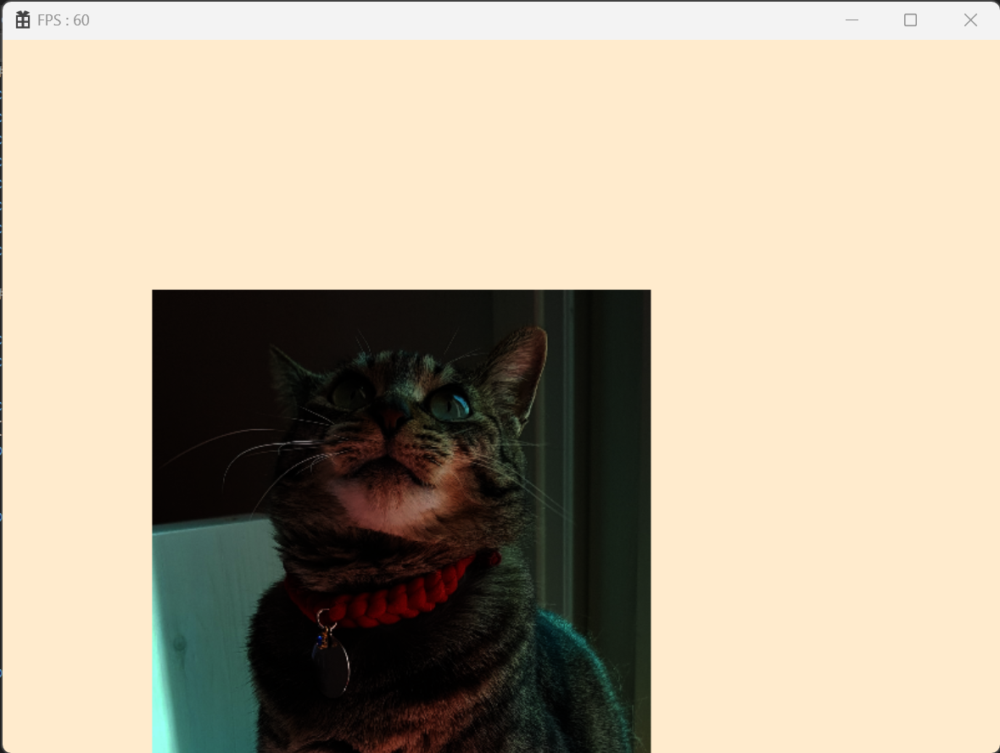

# 🔷 Material
- 물체를 구성하는 물질 또는 물질의 혼합물  

## 1. Material Class
- Shader, Texture 그리고 그 외의 상수값(Material Params)를 묶어서 관리해주는 클래스  
- 기존에 하나씩 넘겨주던 값들을 Material이라는 클래스로 묶어서 관리  

> Material Params
> - CBV로 생성되며 int값 5개, float값 5개, texturer값 5개로 생성한다.  
> - MaterialParams라는 구조체(struct)를 이용하여 int와 float값을 관리한다.  

```cpp
cbuffer MATERIAL_PARAMS : register(b1)
{
    int int_0;
    int int_1;
    int int_2;
    int int_3;
    int int_4;
    float float_0;
    float float_1;
    float float_2;
    float float_3;
    float float_4;
}

Texture2D tex_0 : register(t0);
Texture2D tex_1 : register(t1);
Texture2D tex_2 : register(t2);
Texture2D tex_3 : register(t3);
Texture2D tex_4 : register(t4);
```

```cpp
enum
{
	MATERIAL_INT_COUNT = 5,
	MATERIAL_FLOAT_COUNT = 5,
	MATERIAL_TEXTURE_COUNT = 5,
};

// b1 register로 한꺼번에 넘기기 위해 Texture는 함께 묶지 않는다.
struct MaterialConstantParams
{
	void SetIntParam(uint8 index, int32 value) { intParams[index] = value; }
	void SetFloatParam(uint8 index, float value) { floatParams[index] = value; }

	array<int32, MATERIAL_INT_COUNT> intParams = { 0, 0, 0, 0, 0 };
	array<float, MATERIAL_FLOAT_COUNT> floatParams = { 0.f, 0.f, 0.f, 0.f, 0.f };
};

class Material
{
    ...

private:
	shared_ptr<Shader>									_shader;
	MaterialConstantParams								_params;
	array<shared_ptr<Texture>, MATERIAL_TEXTURE_COUNT>	_textures = {};
};
```

```cpp
// CBV
MyEngine->GetConstantBuffer(CONSTANT_BUFFER_TYPE::MATERIAL)->PushData(&_params, sizeof(_params));

// SRV
for (size_t i = 0; i < _textures.size(); i++)
{
    if (_textures[i] == nullptr)
        continue;

    SRV_REGISTER reg = SRV_REGISTER(static_cast<int8>(SRV_REGISTER::t0) + i);
    MyEngine->GetTableDescriptorHeap()->SetShaderResourceView(_textures[i]->GetCpuHandle(), reg);
}

// Shader
_shader->Update();
```

<br>

## 2. Constant Buffer 나누기
- Material로 인해 용도별로 ConstantBuffer를 분리  
- Engine에서 ConstantBuffer값을 가져올 때, Type으로 선별하여 가져온다.

```cpp
enum class CONSTANT_BUFFER_TYPE : uint8
{
	TRANSFORM,  // b0
	MATERIAL,   // b1

	END // CONSTANT_BUFFER_COUNT
};

array<shared_ptr<ConstantBuffer>, CONSTANT_BUFFER_COUNT>    _constantBuffers;
shared_ptr<ConstantBuffer> GetConstantBuffer(CONSTANT_BUFFER_TYPE type) 
{ 
    return _constantBuffers[static_cast<uint8>(type)]; 
}
```

<br>

## 3. Mesh에 Material로 정리하기

```cpp
class Mesh
{
    ...

private:
	Transform					_transform = {};
	shared_ptr<Material>		_material;
};
```

<br>

## 🔹 결과  
- 물체의 pos의 x, y, z값에 float_0, float_1, float_2 값을 적용시켜 테스트 하였을 때, 값이 적용된 결과값이 나왔다.
  
<br>

# 📑. 참고
* [Rookiss. [C++과 언리얼로 만드는 MMORPG 게임 개발 시리즈]Part2: 게임 수학과 DirectX12. Inflearn.](https://www.inflearn.com/course/%EC%96%B8%EB%A6%AC%EC%96%BC-3d-mmorpg-2/dashboard)
* [프랭크 D. 루나(2020). DirectX 12를 이용한 3D게임 프로그래밍 입문. 한빛미디어(주).](https://www.hanbit.co.kr/store/books/look.php?p_code=B5088646371)