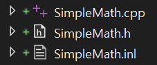
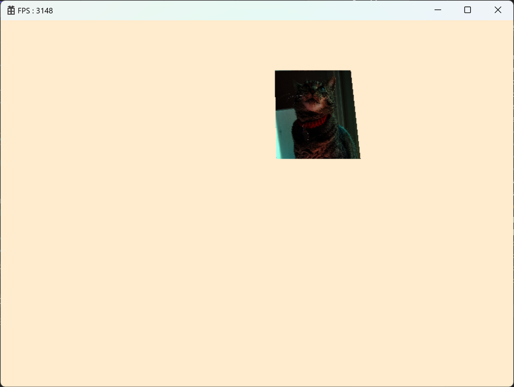

> DirectXTK의 [SimpleMath](https://github.com/microsoft/DirectXTK12)를 활용하여 프로젝트 진행  
> - DX를 기반으로 추가적 수학함수를 제공한다.  
> 

<br>

# 🔷 Camera
- 카메라가 보는 시야의 결과물을 만든다.

<br>

## 1. Camera
### 1.1. Camera Class
- 카메라의 관점으로 좌표를 옮기는 ViewMatrix와 카메라가 보는 장면으로 좌표를 옮기는 ProjectionMatrix를 관리하는 클래스
- 카메라의 투영은 원근 투영과, 직교 투영으로 나눈다.

```cpp
enum class PROJECTION_TYPE
{
	PERSPECTIVE,    // 원근 투영
	ORTHOGRAPHIC,   // 직교 투영
};
```

```cpp
class Camera : public Component
{
...
private:
	PROJECTION_TYPE	_type = PROJECTION_TYPE::PERSPECTIVE;
	
	float			_near = 1.f;        // 절두체의 가장 가까운 면의 거리
	float			_far = 1000.f;      // 절두체의 가장 먼 면의 거리
	float			_fov = XM_PI / 4.f; // 카메라 시야 각도
	float			_scale = 1.f;       // 직교투영에서 사용

	Matrix			_matView = {};          // 뷰 행렬
	Matrix			_matProjection = {};    // 투영 행렬
};
```

1) 카메라의 뷰행렬과 투영 행렬을 구한다.

```cpp
// 뷰 행렬
_matView = GetGameObject()->GetTransform()->GetLocalToWorldMatrix().Invert();

float width = static_cast<float>(MyEngine->GetWindow().width);
float height = static_cast<float>(MyEngine->GetWindow().height);

// 투영 행렬
if (_type == PROJECTION_TYPE::PERSPECTIVE)
    _matProjection = ::XMMatrixPerspectiveFovLH(_fov, width / height, _near, _far);
else
    _matProjection = ::XMMatrixOrthographicLH(width * _scale, height * _scale, _near, _far);
```

2) 활성화 된 Scene의 GameObject들을 카메라의 관점에서 렌더링한다.

```cpp
shared_ptr<Scene> scene = SceneManager::GetInstance()->GetActiveScene();

// TODO : Layer 구분
const vector<shared_ptr<GameObject>>& gameObjects = scene->GetGameObjects();

for (auto& gameObject : gameObjects)
{
    if (gameObject->GetMeshRenderer() == nullptr)
        continue;

    GetGameObject()->GetTransform()->PushData();
	gameObject->GetMeshRenderer()->Render();
}
```

<br>

### 1.2. KeyInputScript Class
- 키보드 입력에 따른 Transform을 변경하는 동작을 하는 스크립트 

```cpp
shared_ptr<Transform> transform = GetGameObject()->GetTransform();
Vec3 pos = transform->GetLocalPosition();

float deltaTime = Timer::GetInstance()->GetDeltaTime();

if (Input::GetInstance()->IsButtonPress(KEY_TYPE::W)) 	// 앞
	pos += transform->GetLook() * _speed * deltaTime;

if (Input::GetInstance()->IsButtonPress(KEY_TYPE::S))	// 뒤
	pos -= transform->GetLook() * _speed * deltaTime;

if (Input::GetInstance()->IsButtonPress(KEY_TYPE::A))	// 왼쪽
	pos -= transform->GetRight() * _speed * deltaTime;

if (Input::GetInstance()->IsButtonPress(KEY_TYPE::D))	// 오른쪽
	pos += transform->GetRight() * _speed * deltaTime;

if (Input::GetInstance()->IsButtonPress(KEY_TYPE::Q))	// 회전(위)
{
	Vec3 rotation = transform->GetLocalRotation();
	rotation.x -= deltaTime * 0.5f;
	transform->SetLocalRotation(rotation);
}

if (Input::GetInstance()->IsButtonPress(KEY_TYPE::E))	// 회전(아래)
{
	Vec3 rotation = transform->GetLocalRotation();
	rotation.x += deltaTime * 0.5f;
	transform->SetLocalRotation(rotation);
}

transform->SetLocalPosition(pos);
```

<br>

## 2. Component 파생 클래스 구체화

### 2.1. Transform Class
- Local의 Position, Rotation, Scale에 관한 벡터값, Local, World행렬을 관리하는 클래스

```cpp
class Transform : public Component
{
...
private:
	weak_ptr<Transform>	_parent;    // 현재 객제의 좌표에 기준이 되는 Transform

	Vec3				_localPosition = {};
	Vec3				_localRotation = {};
	Vec3				_localScale = { 1.f, 1.f, 1.f };

	Matrix				_matLocal = {};
	Matrix				_matWorld = {};
};
```

1) 변경되는 값에 따라 SRT값과 Local, World행렬 값을 갱신한다.

```cpp
Matrix matScale = Matrix::CreateScale(_localScale);                     // S
Matrix matRotation = Matrix::CreateRotationX(_localRotation.x);
matRotation *= Matrix::CreateRotationY(_localRotation.y);
matRotation *= Matrix::CreateRotationZ(_localRotation.z);               // R
Matrix matTranslation = Matrix::CreateTranslation(_localPosition);      // T

_matLocal = matScale * matRotation * matTranslation;
_matWorld = _matLocal;

shared_ptr<Transform> parent = GetParent().lock();
if (parent != nullptr)
    _matWorld += parent->GetLocalToWorldMatrix();
```

2) Transform을 계산하여 CBV(b0)로 넘겨준다.

```cpp
Matrix matWVP = _matWorld * matVP; // matVP :  ViewMatrix, ProjectionMatrix를 합성한 값
MyEngine->GetConstantBuffer(CONSTANT_BUFFER_TYPE::TRANSFORM)->PushData(&matWVP, sizeof(matWVP));
```

<br>

### 2.2. MeshRenderer Class
- 기존과 같음

<br>

## 3. HLSL

```cpp
cbuffer TRANSFORM_PARAMS : register(b0)
{
    row_major matrix matWVP;
}

VS_OUT VS_Main(VS_IN input)
{
    VS_OUT output = (VS_OUT)0;

    output.pos = mul(float4(input.pos, 1.f), matWVP); // 좌표변환
    output.color = input.color;
    output.uv = input.uv;

    return output;
}
```

## 🔹 결과  
  

<br>

<br>

# 📑. 참고
* [Rookiss. [C++과 언리얼로 만드는 MMORPG 게임 개발 시리즈]Part2: 게임 수학과 DirectX12. Inflearn.](https://www.inflearn.com/course/%EC%96%B8%EB%A6%AC%EC%96%BC-3d-mmorpg-2/dashboard)
* [프랭크 D. 루나(2020). DirectX 12를 이용한 3D게임 프로그래밍 입문. 한빛미디어(주).](https://www.hanbit.co.kr/store/books/look.php?p_code=B5088646371)