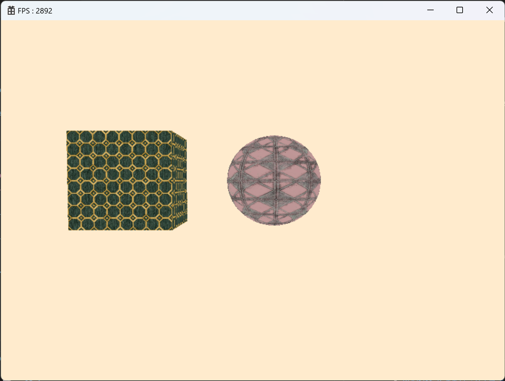

# 🔷 Resources
## 1. Object Class
- Scene에 추가 할 수 있는 모든 객체들의 최상위 클래스

```cpp
enum class OBJECT_TYPE : uint8
{
	NONE,
	GAMEOBJECT,
	COMPONENT,
	MATERIAL,
	MESH,
	SHADER,
	TEXTURE,

	END
};
```

```cpp
class Object
{
...
private:
	OBJECT_TYPE		_objectType = OBJECT_TYPE::NONE;
	wstring			_name;
};
```

<br>

## 2. Resources Class
- Material, Mesh, Shader, Textrue, Prefabricated building 등의 Resrouce를 불러오고 관리하는 클래스

```cpp
#pragma once
#include "Object.h"

class Mesh;

class Resources
{
...
private:
	using KeyObjectMap = std::map<wstring, shared_ptr<Object>>; // key, object
	array<KeyObjectMap, OBJECT_TYPE_COUNT> _resources;
};
```

<br>

## 🔹 결과  
  

<br>

# 📑. 참고
* [Rookiss. [C++과 언리얼로 만드는 MMORPG 게임 개발 시리즈]Part2: 게임 수학과 DirectX12. Inflearn.](https://www.inflearn.com/course/%EC%96%B8%EB%A6%AC%EC%96%BC-3d-mmorpg-2/dashboard)
* [프랭크 D. 루나(2020). DirectX 12를 이용한 3D게임 프로그래밍 입문. 한빛미디어(주).](https://www.hanbit.co.kr/store/books/look.php?p_code=B5088646371)