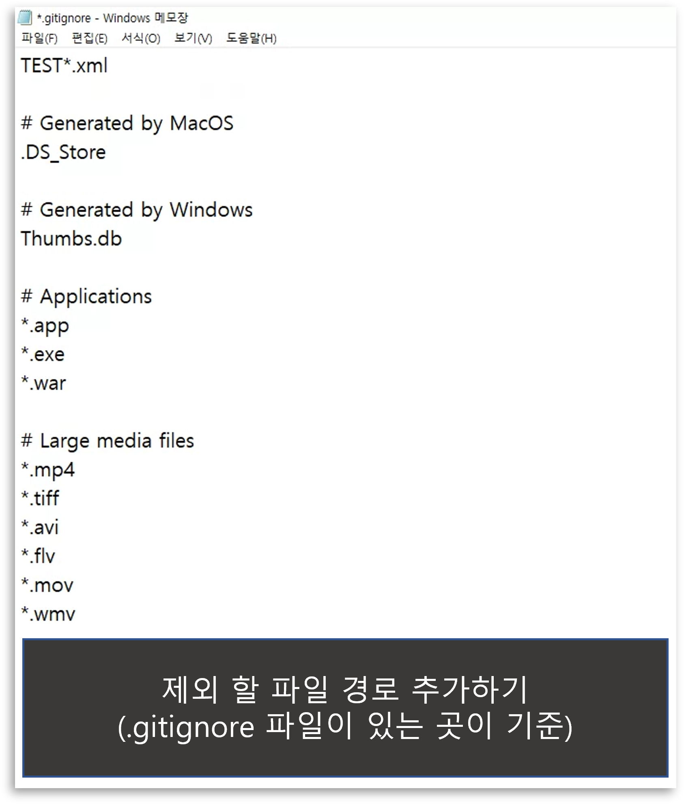

# 1. .gitignore
- git에서 추적을 하지 않을 파일을 설정할 수 있는 곳.

# 2. 사용법
## 1. `.gitignore`에 추적하지 않을 파일 경로 설정


## 2. 사용 도중에 `.gitignore` 추가
```console
$ git rm -r --cached .
$ git add .
$ git commit -m "git ignore add"
$ git push
```
> 현재 추적하는 파일 전체 삭제 후 다시 등록해주는 것
