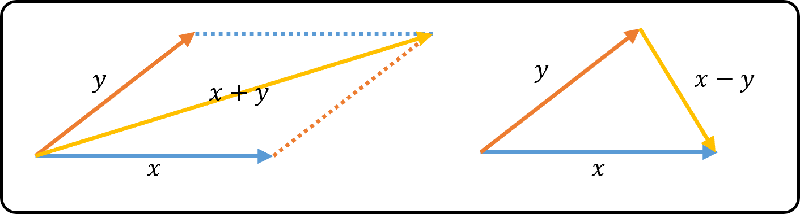
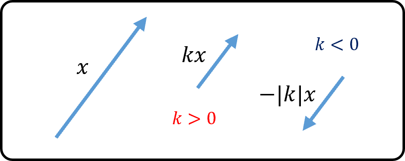

# 1. 벡터(Vector)
## 1.1 공학과 수학에서의 벡터 : n-공간
  1. 스칼라(`scalar`) : `크기`만 주어지지만 완전히 표시되는 양
  2. 벡터(`vector`) : `크기`뿐만 아니라 `방향`까지 지정하지 않으면 완전히 표현할 수 없는 양  
    - 2차원, 3차원 공간의 벡터는 `화살표`로 표현 가능하다.  
    - 시작점과 끝점이 같아 크기가 0인 벡터를 `영벡터`라 한다.  
    - 벡터는 `크기`와 `방향`이 `같으면` 시작점에 관계없이 항상 `동일한 벡터`로 간주한다.  
    - 모든 벡터는 `점의 좌표`를 이용하여 나타낼 수 있다.  

 

  - 덧셈, 뺄셈  
    > - $x+y$는 $x, y$에 의하여 결정되는 `평행사변형의 대각선으로 표시되는 벡터`이다.  
    > 

 

  - 스칼라배
    > - $k>0$이면, $x$와 `방향이 같으`면서 길이는 $k$배하여 얻어지는 벡터.
    > - $k<0$이면, $x$와 `방향이 반대`면서 길이는 $\lvert k \rvert$배하여 얻어지는 백터.
    > - $\mathrm{x}=k\mathrm{y}$이면, $\mathrm{x}$와 $\mathrm{y}$는 `평행`하다.
    > 

 

  - n차원 벡터
    > $n$개의 실수의 순서조$(x_1, x_2, \dots, x_n)$을 `n차원 벡터(n-demensional vector)`라 하고  
    > $$\mathrm{x}=(x_1, x_2, \dots, x_n)=\begin{bmatrix}x_1\\x_2\\\vdots\\x_n\end{bmatrix}_{n\times1}$$  
    > 로 나타낸다. 이때 실수 $x_1, x_2, \dots, x_n$을 $x$의 `성분`이라 한다.

 

  - 상등
    > $\mathbb{R}^n$의 벡터  
    > $$\mathrm{x}=\begin{bmatrix}x_1\\x_2\\\vdots\\x_n\end{bmatrix},\mathrm{y}=\begin{bmatrix}y_1\\y_2\\\vdots\\y_n\end{bmatrix}$$
    > 에 대하여 $x_i=y_i$ $(i=1,2, \dots, n)$이면, $x=y$라고 한다.  
    > - $(1)\mathrm{x}\pm\mathrm{y}=\begin{bmatrix}x_1\pm y_1 \\\ x_2\pm y_2 \\\ \vdots \\\ x_n\pm y_n\end{bmatrix}(2)k\mathrm{x}=\begin{bmatrix}kx_1 \\\ kx_2 \\\ \vdots \\ kx_n\end{bmatrix}$

 

  - 일차결합
    > $v_1, v_2, \dots, v_k$가 $\mathbb{R}^n$의 벡터이고, 계수 $c_1, c_2, \dots, c_k$가 실수일 때,  
    > $$ \mathrm{x}=c_1v_1+c_2v_2+ \dots + c_kv_k$$  
    > 인 형태를 $v1,v2,\dots,v_k$의 `일차결합(linear combination)`이라 한다.  

 

## 1.2 내적과 직교
  - 노름
    > $\mathbb{R}^n$의 벡터 $x=(x_1, x_2, \dots, x_n)$에 대하여  
    > $$\|\mathrm{x}\|=\sqrt{x_1^2+x_2^2+ \dots + x_n^2}$$  
    > 을 $x$의 `노름(norm, length magnitude)`이라 한다.  
    > - `원점`에서 점 $P(x_1, x_2, \dots, x_n)$에 이르는 `거리`이다.  
    > - 두 벡터의 거리   
    > $$\|\mathrm{x}-\mathrm{y}\|=\sqrt{(x_1-y_1)^2+(x_2-y_2)^2+\dots+(x_n-y_n)^2}$$
    > - `단위벡터`(unit vector)  
    > $$\|\mathrm{x}\|=1, \; \mathrm{u}=\frac{1}{\|\mathrm{x}\|}\mathrm{x}$$

 
  
  - 내적
    > $\mathbb{R}^n$의 벡터 $\mathrm{x}=(x_1,x_2,\dots,x_n)$와 $\mathrm{y}=(y_1,y_2,\dots,y_n)$에 대하여,  
    > $$\mathrm{x}\cdot\mathrm{y}=x_1y_1+x_2y_2+\dots+x_ny_n$$  
    > $$\mathrm{x}\cdot\mathrm{y}=\|\mathrm{x}\|\|\mathrm{x}\|\cos{\theta},\;0\le\theta\le\pi$$  
    > `내적(Euclidean inner product, dot product)`이라 한다.  
    > - $\mathrm{x}\cdot\mathrm{x}=\|\mathrm{x}\|^2$
    > - $\mathrm{x}\cdot\mathrm{x}\ge0,\; \mathrm{x}\cdot\mathrm{x}=0\Leftrightarrow \mathrm{x}=0$
    > - $\mathrm{x}\cdot\mathrm{y} = \mathrm{y}\cdot\mathrm{x}$
    > - $(\mathrm{x}+\mathrm{y})\cdot\mathrm{z}=\mathrm{x}\cdot\mathrm{z}+\mathrm{y}\cdot\mathrm{z}$
    > - $(k\mathrm{x})\cdot\mathrm{y}=\mathrm{x}\cdot(k\mathrm{y})=k(\mathrm{x}\cdot\mathrm{y})$
    > - $\mathrm{x}\cdot\mathrm{y}=0$이면, $\mathrm{x}$와 $\mathrm{y}$는 `직교`한다. (직교벡터)
  
 

  - 코시-슈바르츠 부등식(Cauchy-Schwarz Inequality)
    > $\mathbb{R}^n$의 임의의 벡터 $\mathrm{x}$ $\mathrm{y}$에 대하여 다음 부등식이 성립한다.  
    > $$|\mathrm{x}\cdot\mathrm{y}|\le\|\mathrm{x}\|\|\mathrm{y}\|$$  
    > 단, 등호는 $\mathrm{x}$, $\mathrm{y}$ 중 하나가 다른 것의 `실수배`일 때만 성립한다.  
    > - 증명  
    >> - 삼각부등식  
    >> $$\|\mathrm{x}+\mathrm{y}\|\le\|\mathrm{x}\|\|\mathrm{y}\|$$  
    >> - 단, 등호는 $\mathrm{x}$, $\mathrm{y}$ 중 하나가 다른 것의 $k\ge0$배일 때만 성립한다.
 

 

  - `정규직교(orthonormal)벡터`
    > $\mathrm{x}$, $\mathrm{y}$가 서로 `직교벡터`이면서 `단위벡터`인 벡터
  - `기본단위벡터(standard unit vector, 표준단위벡터)`
    > $$\mathrm{e}_1=(1,0,0,\dots,0),\mathrm{e}_2=(0,1,0,\dots,0),\dots,\mathrm{e}_n=(0,0,0,\dots,1)$$
    
