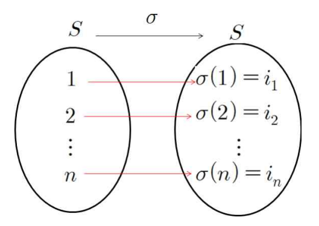
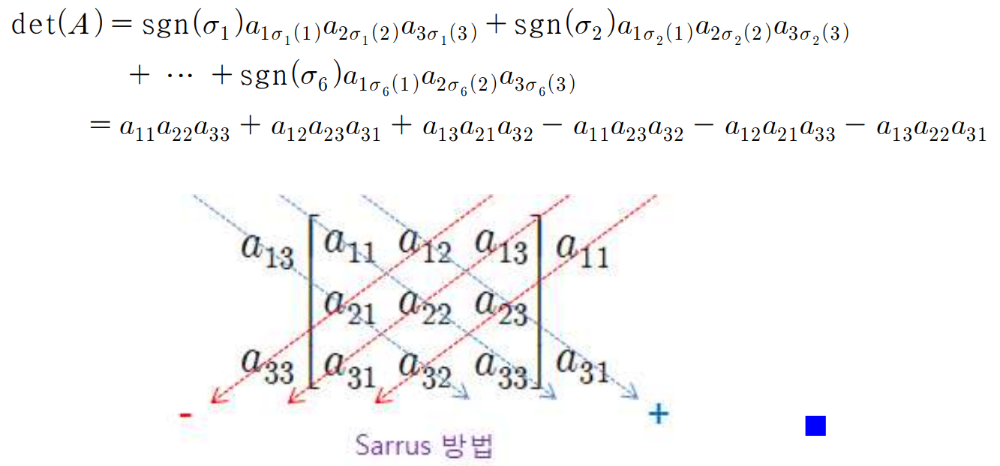

# 1. 행렬식의 정의와 기본정리
## 치환 (Permutation)
- 자연수의 집합 $S=\{1, 2, 3, \dots, N\}$의 `치환`(permutation, 순열) : $S$에서 $S$로의 `1:1대응` 함수  
$$\delta=( \delta(1), \delta(2), \dots, \delta(n) )=(i_1, i_2, \dots, i_n)$$  
  
> ---
> - $S_n$ : 집합$S$의 모든 치환의 집합 표시  
> - $S=\{1, 2, \dots, n\}$의 치환의 개수 : $n!$  

## 반전(Inversion)
- 큰 자연수가 작은 자연수보다 더 왼쪽에 먼저 나타나는 경우  
$$(j_1, j_2, \dots, j_k, \dots, j_i, \dots, j_n), (j_k > j_i)$$  

## 반전수
- j_k에 대한 `반전수` : j_k보다 작은 수의 개수  
$\delta$의 반전수 = $j_1$의 반전수 + $j_2$의 반전수 + $\dots$ + $j_n$의 반전수  
> ---
> 1. `짝치환`(even permutation) : 치환의 반전수가 짝수  
> 2. `홀치환`(odd permutation) : 치환의 반전수가 홀수  

## 부호화 함수(signature function)
- 치환의 부호를 결정  
$$sgn(\delta)=\begin{cases}+1 & (\delta : 짝치환) \\ -1 & (\delta : 홀치환) \end{cases}$$
>
> ---
> - 치환 $\delta$ 안의 임임의 두 수를 바꾼 치환을 $\tau$라 하자,  
> $$sgn(\tau) = -sgn(\delta)$$  
> ※ 치환에서 두 수의 순서가 바뀌면 부호가 바뀐다.  

## 행렬식 (Leibniz Formula)
- 행렬 A=[$a_{ij}$]가 n차 정사각 행렬일 때, A의 행렬식( $det(A), |A|$ )의 정의  (Sarrus 방법)
$$det(A) = |A| = \sum_{\delta \in S_n} {sgn(\delta)a_{1 \delta(1)}a_{2 \delta(2)} \dots a_{n \delta(n)}}$$  
  
※ 행렬 A의 행과 열에서 중복없이 하나씩 뽑아서 곱한 후 대응되는 치환의 부호를 붙인 것.  
> ---
> - 1차 정사각 행렬 A=[$a_{11}$]의 행렬식은 $det(A)=a$이다.  
> - 4차 이상의 행렬식엔 적용할 수 없다.  
>  
> ---
> 행렬식의 성질  
> 1. $det(A) = det(A^T)$  
> 2. 행렬 $B_{n \times n}$이 행렬 $A_{n \times n}$의 두 행(열)을 서로 바꾸어서 얻어진 행렬이라면, $det(B) = -det(A)$ 이다.  
> 3. 행렬 $A_{n \times n}$의 두 행(열)이 일치하면, $det(A) = 0$ 이다.  
> 4. 행렬 $A_{n \times n}$의 한 행(열)의 성분이 모두 $0$이면, $det(A) = 0$ 이다.  
> 5. 행렬 $A_{n \times n}$의 한 행을 $k$배하여 얻어진 행렬을 $B$라 하면, $det(B) = kdet(A)$ 이다.  
> 6. 행렬 $A_{n \times n}$의 두 행이 비례하면, $det(A)=0$ 이다.  
> 7. 행렬 $A_{n \times n}$의 한 행의 $k$배를 다른 행에 더하여 얻어진 행렬을 $B_{n \times n}$라 하면, $det(B) = det(A)$이다.  
> 8. 행렬 $A_{n \times n}$가 n차 삼각행렬이면, $det(A)=a_{11}a_{22}a_{33}$ \dots a_{nn}$(주대각성분의 곲) 이다.  
> 9. $det(AB) = det(A)det(B)$  
>
> ---
> 기본행렬(Elementary Matrix)의 행렬식  
> 1. $E$가 $I_n$의 한 행에 $k(k\ne0)$을 곱한 것이면, $det(E)=k$ 이다.  
> 2. $E$가 $I_n$의 두 행을 서로 바꾼 것 이면, $det(E)=-1$ 이다.  
> 3. $E$가 $I_n$의 한 행에 $k$배하여 다른 행에 더한 것 이면, $det(E)=1$ 이다.  
> 4. $E$가 n차 기본행렬이면, $det(EA) = det(E)det(A)$ 이다.  

## 가역행렬의 행렬식
- 행렬 $A_{n \times n}$가 가역행렬일 필요충분조건  
$$det(A) \ne 0$$  
> 행렬 $A_{n \times n}$가 가역이면 $det(A)=0$ 이고, $det(A^{-1})= \frac{1}{det(A)}$ 이 성립한다.

 

# 2. 여인자 전개와 행렬식의 응용
## 소행렬식(minor)과 여인자(codactor)

