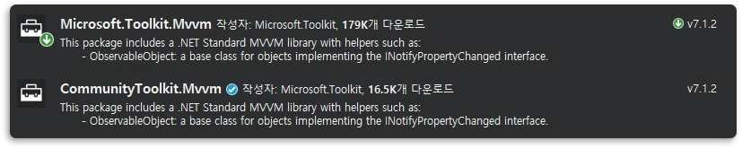

# 1. Microsoft.Toolkit.Mvvm
- MVVM패턴 구현을 위한 방법을 찾다가 발견하게 된 MVVM 라이브러리이다.
- Visual Studio의 `Manage NuGet Package(NuGet 패키지 관리)`로 설치 할 수 있다.
  > 
  > - `Microsoft.Toolkit.Mvvm`과 `CommunityToolkit.Mvvm`이 존재한다. 제공하는 기능은 같은 듯 하지만, 파일의 크기는 CommunityToolkit.Mvvm이 더 적다
  > - 참고하는 사이트에서 Microsoft.Toolkit.Mvvm을 사용하기 때문에 일단 같은 것으로 진행한다.

```csharp
using Microsoft.Toolkiy.Mvvm;
```

<br>

# 2. 제공하는 기능

### 1. Microsoft.Toolkit.Mvvm.`ComponentModel`
- 바인딩과 관련된 기능을 제공
  - ObservableObject
  - ObservableRecipient
  - ObservableValidator
  
### 2. Microsoft.Toolkit.Mvvm.`DependencyInjection`
- 종속성 주입과 관련된 기능을 제공
  - Ioc
  
### 3. Microsoft.Toolkit.Mvvm.`Input`
- 커맨드 관련 기능을 제공
  - RelayCommand
  - RelayCommand<T>
  - AsyncRelayCommand
  - AsyncRelayCommand<T>
  - IRelayCommand
  - IRelayCommand<int T>
  - IAsyncRelayCommand
  - IAsyncRelayCommand<in T>
  
### 4. Microsoft.Toolkit.Mvvm.`Messaging`
- 메신저 관련 기능 제공
  - IMessenger
  - WeakReferenceMessenger
  - StrongReferenceMessenger
  - IRecipient<TMessage>
  - MessageHandler<TRecipient, TMessage>
  
### 5. Microsoft.Toolkit.Mvvm.`Messaging.Messages`
- 메세지 클래스 인터페이스 제공
  - PropertyChangedMessage<T>
  - RequestMessage<T>
  - AsyncRequestMessage<T>
  - CollectionRequestMessage<T>
  - AsyncCollectionRequestMessage<T>
  - ValueChangedMessage<T>

<br>

# 📑. 참고
* [Introduction to the MVVM Toolkit](https://docs.microsoft.com/en-us/windows/communitytoolkit/mvvm/introduction)
* [CommunityToolkit/MVVM-Samples](https://github.com/CommunityToolkit/MVVM-Samples)
* [Connor Park. MVVM Toolkit 사용 가이드.](https://kaki104.tistory.com/674)
